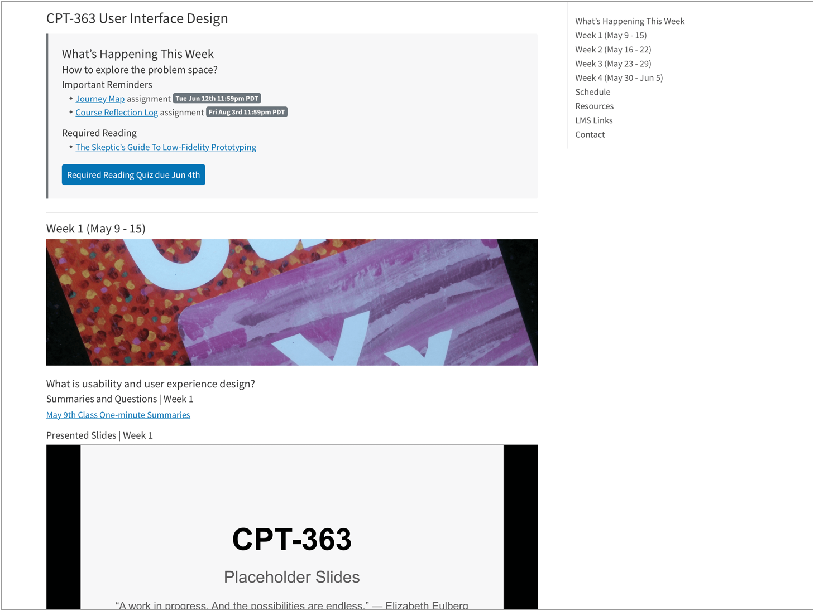
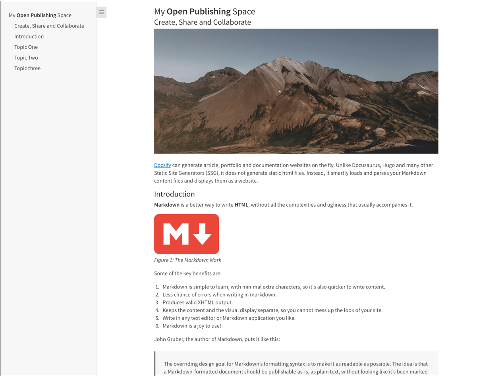
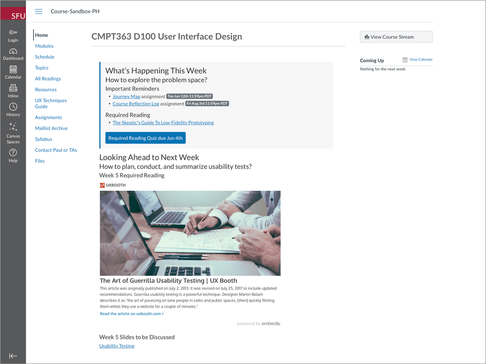
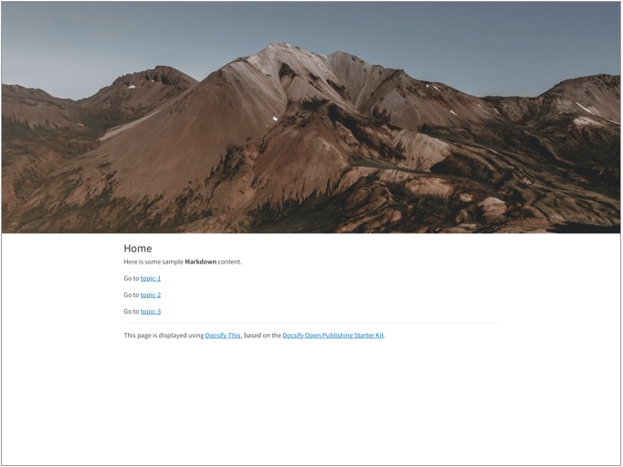

[](https://docsify.js.org/)
[](https://github.com/hibbitts-design/docsify-open-multicourse-starter-kit/blob/main/LICENSE)
<a href="https://discord.gg/docsify">
    
</a>

## Instantly Turn Online Markdown Files into Web Pages

The open-source web app [Docsify-This](https://docsify-this.net), built with the magical documentation site generator [Docsify](https://docsify.js.org), provides a quick way to publish one or more online Markdown files as standalone web pages without needing to setup your own website. All you need is a publicly available Markdown file and pass that URL to docsify-this.net.


_Figure 1. [Docsify-This.net](https://docsify-this.net) Web Page Builder._

## All About Docsify-This

* [What Problem Does Docsify-This Solve?](#what-problem-does-docsify-this-solve)
* [How Docsify-This Works](#how-docsify-this-works)
* [Example Workflow using GitHub Markdown Files](#example-usage-scenarios)
* [Ready-to-Use Docsify-This Markdown Templates](#ready-to-use-docsify-this-markdown-templates)
* [More Docsify-This Markdown Examples](#more-docsify-this-markdown-examples)
* [Page Appearance URL Parameters](#page-appearance-url-parameters)
* [Embedding Docsify-This Pages into Other Platforms](#embedding-docsify-this-pages-into-other-platforms)
* [Markdown Syntax References](#markdown-syntax-references)
* [Font Awesome Icons](#font-awesome-icons)
* [Supported Markdown CSS Classes](#supported-markdown-css-classes)
* [Custom Markdown CSS Classes](#custom-markdown-css-classes)
* [Tips and Techniques](#tips-and-techniques)
* [Improving Markdown Previews in Text Editors](#improving-markdown-previews-in-text-editors)
* [Looking for Even More Customization and Control?](#looking-for-even-more-customization-and-control)
* [Troubleshooting](#troubleshooting)
* [Privacy Policy Summary](#privacy-policy-summary)
* [Support this Project](#support-this-project)

---

### What Problem Does Docsify-This Solve?

Docsify-This provides an easy way to display and share [Markdown](https://www.markdownguide.org/basic-syntax/) content in various contexts, with no website setup or build process required. Collaborative authoring using GitHub is also supported.  

With Docsify-This you can:

* Publish your Markdown files as standalone web pages, with no website setup or build process required
* Visually style your standalone web pages using a point-and-click Web Page Builder
* Share existing GitHub-hosted Markdown files as standalone web pages, with an optional 'Edit this Page' link
* Seamlessly embed constraint-free Markdown/HTML, which you have authored, into other platforms (e.g. LMS or CMS)
* Reuse existing Markdown content by seamlessly embedding it within other platforms (e.g. LMS or CMS)
* Utilize the supported URL parameters when embedding content to match each destination platform better visually

---

### How Docsify-This Works

Docsify-This is a customized [Docsify Open Publishing Starter Kit](https://github.com/hibbitts-design/docsify-open-publishing-starter-kit) site configured to render remote Markdown files via URL parameters in the following format:

`https://docsify-this.net?basePath=URLpath&homepage=filename.md`

The **basePath** Docsify parameter is the URL path containing the raw source Markdown file to render. If the file is named the expected default **README.md** then no other parameter are required, otherwise the **homepage** Docsify parameter must also be included set to the name of the file to render. An example Docsify-This URL would be:
https://docsify-this.net/?basePath=https://raw.githubusercontent.com/hibbitts-design/docsify-this-one-page-article/main&homepage=home.md  

To render a file stored in a public GitHub repository you need to use the raw source URL of that file (i.e. raw.githubusercontent.com) - tap the **Raw** button when [viewing a file](https://docs.github.com/en/repositories/working-with-files/using-files/viewing-a-file) to get this URL when not using the above Web Page Builder, which does this automatically. It is also possible to render a file stored in a private GitHub repository by activating GitHub Pages within that repository and then using the GitHub Pages URL of that file (i.e. username.github.io).  

The appearance of rendered Markdown files can be customized by optional [URL parameters](#page-appearance-url-parameters) and a small set of available [CSS Classes](#supported-markdown-css-classes) within source Markdown files. In addition to supporting standard Markdown, [Embed.ly](https://embed.ly/code), [H5P](https://h5p.org/), [Katex](https://github.com/upupming/docsify-katex), and [Mermaid Diagrams](https://github.com/Leward/mermaid-docsify) are included. Optionally, page annotation with [Hypothes.is](https://hypothes.is) can be enabled.  

Looking for an overall introduction to publishing with Docsify-This? Check out [Markdown Publishing with Docsify-This](https://docsify-this.net/?basePath=https://raw.githubusercontent.com/hibbitts-design/publishing-with-docsify-this/main&sidebar=true&edit-link=https://github.com/hibbitts-design/publishing-with-docsify-this/blob/main/README.md&maxLevel=4&title=Markdown%20Publishing%20with%20Docsify-This).

---

### Example Content Workflows

<div class="row">
<div class="column">

  
_Docsify-This.net open and collaborative workflow using GitHub Markdown files._

</div>
<div class="column">


_Docsify-This.net workflow using Webserver Markdown files._

</div>
</div>

---

### Ready-to-Use Docsify-This Markdown Templates

While all you need to get going with Docsify-This is a basic Markdown file, here are some templates (with step-by-step how to use instructions) you can use that show what is possible with Markdown, images, and even a few HTML snippets!

#### [Docsify-This One Page Course Template](https://github.com/hibbitts-design/docsify-this-one-page-course)



One Page Course [home.md](https://github.com/hibbitts-design/docsify-this-one-page-course/blob/main/home.md) file displayed by Docsify-This as a:
* [Standalone Page](https://docsify-this.net/?basePath=https://raw.githubusercontent.com/hibbitts-design/docsify-this-one-page-course/main&homepage=home.md "Single Page Docsify Open Course Starter Kit - Standalone Page")  
* [Standalone Page with Table of Contents and an 'Edit this Page' link](https://docsify-this.net/?basePath=https://raw.githubusercontent.com/hibbitts-design/docsify-this-one-page-course/main&homepage=home.md&toc=true&edit-link=https://github.com/hibbitts-design/docsify-this-one-page-course/blob/main/home.md "Single Page Docsify Open Course Starter Kit - Standalone Page with Table of Contents")  
* [Standalone Page with Docsify Sidebar and an 'Edit this Page' link](https://docsify-this.net/?basePath=https://raw.githubusercontent.com/hibbitts-design/docsify-this-one-page-course/main&homepage=home.md&sidebar=true&edit-link=https://github.com/hibbitts-design/docsify-this-one-page-course/blob/main/home.md "Single Page Docsify Open Course Starter Kit - Standalone Page with Docsify Sidebar")

#### [Docsify-This One Page Article Template](https://github.com/hibbitts-design/docsify-this-one-page-article)  



One Page Article [home.md](https://github.com/hibbitts-design/docsify-this-one-page-article/blob/main/home.md) file displayed by Docsify-This as a:    
* [Standalone Page](https://docsify-this.net/?basePath=https://raw.githubusercontent.com/hibbitts-design/docsify-this-one-page-article/main&homepage=home.md "Single Page Docsify Open Course Starter Kit - Standalone Page")  
* [Standalone Page with Table of Contents including h2 and h3 Headers and an 'Edit this Page' link](https://docsify-this.net/?basePath=https://raw.githubusercontent.com/hibbitts-design/docsify-this-one-page-article/main&homepage=home.md&toc=true&toc-headings=h2,h3&edit-link=https://github.com/hibbitts-design/docsify-this-one-page-article/blob/main/home.md "Single Page Docsify Open Course Starter Kit - Standalone Page with Table of Contents")  
* [Standalone Page with Docsify Sidebar with maxLevel of 3 (H3) and an 'Edit this Page' link](https://docsify-this.net/?basePath=https://raw.githubusercontent.com/hibbitts-design/docsify-this-one-page-article/main&homepage=home.md&sidebar=true&maxLevel=3&edit-link=https://github.com/hibbitts-design/docsify-this-one-page-article/blob/main/home.md "Single Page Docsify Open Course Starter Kit - Standalone Page with Docsify Sidebar")

#### [Docsify-This LMS Content Pages Template](https://github.com/hibbitts-design/docsify-this-lms-content-pages)



Example pages, including the use of the `font-family`, `font-size` and `hide-credits` URL parameters for seamless content embedding within the Canvas LMS, as displayed by Docsify-This:  
* [Embeddable Home Page](https://docsify-this.net/?basePath=https://raw.githubusercontent.com/hibbitts-design/docsify-this-lms-content-pages/main&homepage=home.md&font-family=Lato%20Extended,%20Lato,Helvetica%20Neue,%20Helvetica,%20Arial,%20sans-serif&amp;font-size=1&amp;hide-credits=true "Embeddable Home Page")
* [Embeddable Weekly Module Page](https://docsify-this.net/?basePath=https://raw.githubusercontent.com/hibbitts-design/docsify-this-lms-content-pages/main&homepage=module-01.md&font-family=Lato%20Extended,%20Lato,Helvetica%20Neue,%20Helvetica,%20Arial,%20sans-serif&amp;font-size=1&amp;hide-credits=true "Embeddable Weekly Module Page")
* [Embeddable Schedule Page](https://docsify-this.net/?basePath=https://raw.githubusercontent.com/hibbitts-design/docsify-this-lms-content-pages/main&homepage=schedule.md&font-family=Lato%20Extended,%20Lato,Helvetica%20Neue,%20Helvetica,%20Arial,%20sans-serif&amp;font-size=1&amp;hide-credits=true "Embeddable Schedule Page")
* [Embeddable Topics Page](https://docsify-this.net/?basePath=https://raw.githubusercontent.com/hibbitts-design/docsify-this-lms-content-pages/main&homepage=topics.md&font-family=Lato%20Extended,%20Lato,Helvetica%20Neue,%20Helvetica,%20Arial,%20sans-serif&amp;font-size=1&amp;hide-credits=true "Embeddable Topics Page")
* [Embeddable Resources Page](https://docsify-this.net/?basePath=https://raw.githubusercontent.com/hibbitts-design/docsify-this-lms-content-pages/main&homepage=resources.md&font-family=Lato%20Extended,%20Lato,Helvetica%20Neue,%20Helvetica,%20Arial,%20sans-serif&amp;font-size=1&amp;hide-credits=true "Embeddable Resource Page")
* [Embeddable UX Techniques Guide Page (using Accordion format)](https://docsify-this.net/?basePath=https://raw.githubusercontent.com/hibbitts-design/docsify-this-lms-content-pages/main&homepage=ux-techniques-guide.md&font-family=Lato%20Extended,%20Lato,Helvetica%20Neue,%20Helvetica,%20Arial,%20sans-serif&amp;font-size=1&amp;hide-credits=true "Embeddable UX Techniques Guide Page (using Accordion format)")
* [Embeddable Contact Page](https://docsify-this.net/?basePath=https://raw.githubusercontent.com/hibbitts-design/docsify-this-lms-content-pages/main&homepage=contact.md&font-family=Lato%20Extended,%20Lato,Helvetica%20Neue,%20Helvetica,%20Arial,%20sans-serif&amp;font-size=1&amp;hide-credits=true "Embeddable Contact Page")

#### [Docsify-This Multiple Page Site Template](https://github.com/hibbitts-design/docsify-this-multiple-page-site)



Multiple Page Site [home.md](https://github.com/hibbitts-design/docsify-this-multiple-page-site/blob/main/home.md) file, including the use of the Markdown CSS class `header-image-full-width`, displayed by Docsify-This as:  
* [Standalone Pages](https://docsify-this.net/?basePath=https://raw.githubusercontent.com/hibbitts-design/docsify-this-multiple-page-site/main&homepage=home.md "Docsify-This Multiple Page Site - Standalone Pages")  
* [Standalone Pages and 'Edit this Page' links](https://docsify-this.net/?basePath=https://raw.githubusercontent.com/hibbitts-design/docsify-this-multiple-page-site/main&homepage=home.md&edit-link=https://github.com/hibbitts-design/docsify-this-multiple-page-site/blob/main/home.md "Docsify-This Multiple Page Site - Standalone Pages and 'Edit this Page' links")  
* [Standalone Pages with Docsify Navbar](https://docsify-this.net/?basePath=https://raw.githubusercontent.com/hibbitts-design/docsify-this-multiple-page-site/main&homepage=home.md&loadNavbar=_navbar "Docsify-This Multiple Page Site - Standalone Pages with Docsify Navbar")  
* [Standalone Pages with Docsify Navbar and 'GitHub Repository' link](https://docsify-this.net/?basePath=https://raw.githubusercontent.com/hibbitts-design/docsify-this-multiple-page-site/main&homepage=home.md&loadNavbar=_navbar&edit-link=https://github.com/hibbitts-design/docsify-this-multiple-page-site&edit-link-text=GitHub%20Repository "Docsify-This Multiple Page Site - Standalone Pages with Docsify Navbar and 'GitHub Repository' link")  

---

### More Docsify-This Markdown Examples

[GitHub Training Manual Working Locally with Git Markdown file](https://github.com/githubtraining/training-manual/blob/main/docs/06_working_locally.md), displayed by Docsify-This as a:  
* [Standalone Page](https://docsify-this.net/?basePath=https://raw.githubusercontent.com/githubtraining/training-manual/main/docs&homepage=06_working_locally.md "GitHub Training Manual Working Locally with Git - Standalone Page")  
* [Standalone Page with Table of Contents](https://docsify-this.net/?basePath=https://raw.githubusercontent.com/githubtraining/training-manual/main/docs&homepage=06_working_locally.md&toc=true&toc-headings=h2,h3 "GitHub Training Manual Working Locally with Git - Standalone Page with Table of Contents")
* [Standalone Page with Docsify Sidebar](https://docsify-this.net/?basePath=https://raw.githubusercontent.com/githubtraining/training-manual/main/docs&homepage=06_working_locally.md&sidebar=true&maxLevel=3 "GitHub Training Manual Working Locally with Git - Standalone Page with Docsify Sidebar")

[Easy Markdown to Github Pages linked set of Markdown files](https://github.com/nicolas-van/easy-markdown-to-github-pages), displayed by Docsify-This as:   
* [Standalone Pages](https://docsify-this.net/?basePath=https://raw.githubusercontent.com/nicolas-van/easy-markdown-to-github-pages/master "Easy Markdown to Github Pages - Standalone Page")  
* [Standalone Pages with Table of Contents and an 'Edit this Page' link](https://docsify-this.net/?basePath=https://raw.githubusercontent.com/nicolas-van/easy-markdown-to-github-pages/master&toc=true&edit-link=https://github.com/nicolas-van/easy-markdown-to-github-pages/blob/master/README.md "Easy Markdown to Github Pages - Standalone Page with Table of Contents")  
* [Standalone Pages with Docsify Sidebar and an 'Edit this Page' link](https://docsify-this.net/?basePath=https://raw.githubusercontent.com/nicolas-van/easy-markdown-to-github-pages/master&sidebar=true&edit-link=https://github.com/nicolas-van/easy-markdown-to-github-pages/blob/master/README.md "Easy Markdown to Github Pages - Standalone Page with Docsify Sidebar")

[A Collection of GitHub Markdown files](https://github.com/paulhibbitts/cmpt-363-222-pages) used as course content [within an SFU CMPT-363 Canvas LMS site](https://canvas.sfu.ca/courses/69678).  

[GitHub Markdown Content Demo file](https://github.com/hibbitts-design/docsify-this-markdown-content-demo/blob/main/README.md), displayed by Docsify-This as a [Standalone Page with 'View raw Markdown' link](https://docsify-this.net/?basePath=https://raw.githubusercontent.com/hibbitts-design/docsify-this-markdown-content-demo/main&edit-link=https://raw.githubusercontent.com/hibbitts-design/docsify-this-markdown-content-demo/main/README.md&edit-link-text=View%20raw%20Markdown).  

[Codeberg Markdown Content Demo file](https://codeberg.org/paulhibbitts/docsify-this-markdown-content-demo/src/branch/main/README.md), displayed by Docsify-This as a [Standalone Page with 'View raw Markdown' link](https://docsify-this.net/?basePath=https://raw.codeberg.page/paulhibbitts/docsify-this-markdown-content-demo/&edit-link=https://codeberg.org/paulhibbitts/docsify-this-markdown-content-demo/raw/branch/main/README.md&edit-link-text=View%20raw%20Markdown).  

[GitHub's LaTeX Support Examples Markdown file](https://github.com/dotcom-poland/medium-latex-support/blob/main/README.md), displayed by Docsify-This as a [Standalone Page with an 'Edit this Page' link](https://paulhibbitts.github.io/test-docsify-this/?basePath=https://raw.githubusercontent.com/dotcom-poland/medium-latex-support/main&edit-link=https://github.com/dotcom-poland/medium-latex-support/blob/main/README.md#/).

[Mermaid-Docsify Example GitHub Markdown file](https://github.com/Leward/mermaid-docsify/blob/master/example/README.md), displayed by Docsify-This as a [Standalone Page with an 'Edit this Page' link](https://paulhibbitts.github.io/test-docsify-this/?basePath=https://raw.githubusercontent.com/Leward/mermaid-docsify/master/example&edit-link=https://github.com/Leward/mermaid-docsify/blob/master/example/README.md#/).  

---

### Page Appearance URL Parameters

#### Web Page Builder

* [browser-tab-title](#browser-tab-title)
* [edit-link](#edit-link)
* [edit-link-text](#edit-link-text)
* [edit-link-top](#edit-link-top)
* [font-family](#font-family)
* [font-size](/#font-size)
* [hide-credits](#hide-credits)
* [hypothesis](#hypothesis)
* [line-height](#line-height)
* [maxLevel](#maxLevel)
* [sidebar](/#sidebar)
* [toc](#toc)
* [toc-headings](#toc-headings)
* [toc-narrow](#toc-narrow)

##### browser-tab-title
Set a custom title on Browser tab for your standalone pages with the optional **browser-tab-title** parameter, for example:  
https://docsify-this.net?basePath=https://raw.githubusercontent.com/paulhibbitts/demo-grav-open-matter-course-hub/master/pages/04.resources&homepage=page.md&browser-tab-title=Resources Please note to use titles with spaces they must be [encoded](https://meyerweb.com/eric/tools/dencoder/), so "My Page" would be "My%20Page".  

##### edit-link
Display a "Edit this Page" link (default location is bottom of page) with the optional **edit-link** parameter, for example:  
https://docsify-this.net?basePath=https://raw.githubusercontent.com/hibbitts-design/docsify-open-course-starter-kit/main&edit-link=https://github.com/hibbitts-design/docsify-open-publishing-starter-kit/blob/main/README.md

##### edit-link-text
Change the default text for a "Edit this Page" link with the optional **edit-link-text** parameter, for example:  
https://docsify-this.net?basePath=https://raw.githubusercontent.com/hibbitts-design/docsify-open-course-starter-kit/main&edit-link=https://github.com/hibbitts-design/docsify-open-publishing-starter-kit/blob/main/README.md&edit-link-text=View%20as%20Markdown Please note to use text with spaces they must be [encoded](https://meyerweb.com/eric/tools/dencoder/), so "View as Markdown" would be "View%20as%20Markdown".  

##### edit-link-top
Change the location of the "Edit this Page" link from the bottom of pages to be the top of pages with the optional **edit-link-top** parameter, for example:  
https://docsify-this.net?basePath=https://raw.githubusercontent.com/hibbitts-design/docsify-open-course-starter-kit/main&toc=true&edit-link=https://github.com/hibbitts-design/docsify-open-publishing-starter-kit/blob/main/README.md&edit-link-top=true

##### font-family
Set a custom font for your standalone pages with the optional **font-family** parameter, for example:  
https://docsify-this.net?basePath=https://raw.githubusercontent.com/hibbitts-design/docsify-open-course-starter-kit/main/docs&homepage=resources.md&font-family=Helvetica,Arial,sans-serif. This parameter can be particularly valuable when trying to better match the visual presentation of embedded content with your destination platform. Please note to use fonts with spaces in their names they must be [encoded](https://meyerweb.com/eric/tools/dencoder/), so "Courier New" would be "Courier%20New".  

##### font-size
Set a custom font size for your standalone pages with the optional **font-size** parameter, for example:  
https://docsify-this.net?basePath=https://raw.githubusercontent.com/hibbitts-design/docsify-open-course-starter-kit/main/docs&homepage=resources.md&font-size=1. This parameter can be particularly valuable when trying to better match the visual presentation of embedded content with your destination platform. Please note the font size is set in [REM units](https://www.freecodecamp.org/news/what-is-rem-in-css/).  

##### hide-credits
Hide the credits usually shown at the bottom of every displayed Docsify-This page with the optional **hide-credits** parameter, for example:  
https://docsify-this.net?basePath=https://raw.githubusercontent.com/hibbitts-design/docsify-open-course-starter-kit/main/docs&homepage=resources.md&hide-credits=true.

##### hypothesis
Enable page annotation with [Hypothes.is](https://hypothes.is) with the optional **hypothesiss** parameter, for example:  
https://docsify-this.net?basePath=https://raw.githubusercontent.com/hibbitts-design/docsify-open-course-starter-kit/main/docs&homepage=resources.md&hypothesis=true.  

##### line-height
Set a custom line height for your standalone pages with the optional **line-height** parameter, for example:  
https://docsify-this.net?basePath=https://raw.githubusercontent.com/hibbitts-design/docsify-open-course-starter-kit/main/docs&homepage=resources.md&line-height=1.5. 

##### link-color
Set a custom color for all links, defined using the standard hexadecimal format _without the '#' symbol_ with the optional **link-color** parameter, for example:  
https://docsify-this.net?basePath=https://raw.githubusercontent.com/hibbitts-design/docsify-open-course-starter-kit/main/docs&homepage=resources.md&link-color=CC0000.

##### maxLevel
Set the maximum header level of the Docsify sidebar with the optional **maxLevel** Docsify parameter, for example:  
https://docsify-this.net?basePath=https://raw.githubusercontent.com/hibbitts-design/docsify-open-publishing-starter-kit/main/docs&homepage=introduction.md&sidebar=true&maxLevel=3 

##### sidebar
Display a Docsify sidebar with the optional **sidebar** parameter, for example:  
https://docsify-this.net?basePath=https://raw.githubusercontent.com/hibbitts-design/docsify-open-course-starter-kit/main&sidebar=true 

##### toc
Display a page table of contents with the optional **toc** parameter, for example:  
https://docsify-this.net?basePath=https://raw.githubusercontent.com/hibbitts-design/docsify-open-publishing-starter-kit/main/docs&homepage=introduction.md&toc=true

##### toc-headings
Set the page heading levels (i.e. h1, h2, etc.) to be included in the Page Table of Contents with the optional **toc-headings** parameter, for example:  
https://docsify-this.net?basePath=https://raw.githubusercontent.com/hibbitts-design/docsify-open-publishing-starter-kit/main/docs&homepage=introduction.md&toc=true&toc-headings=h1,h2,h3.

##### toc-narrow
Use a less wide Page Table of Contents with the optional **toc-narrow** parameter, for example:  
https://docsify-this.net?basePath=https://raw.githubusercontent.com/hibbitts-design/docsify-open-publishing-starter-kit/main/docs&homepage=introduction.md&toc-narrow=true. This parameter can be particularly valuable when embedding content where a smaller screen area is likely.  

#### Additional URL Parameters

The following URL parameters are available but not included in the Web Page Builder.

* [coverpage](#coverpage)
* [coverpage-color](#coverpage-color)
* [coverpage-color-dark-mode](#coverpage-color-dark-mode)
* [dark-mode](#dark-mode)
* [header-weight](#header-weight)
* [link-color-dark-mode](#link-color-dark-mode)
* [loadFooter](#loadFooter)
* [loadNavbar](#loadNavbar)
* [page-title](#page-title)

##### coverpage
Display a Docsify coverpage with the optional **coverpage** parameter, for example:  
https://docsify-this.net?basePath=https://raw.githubusercontent.com/hibbitts-design/docsify-open-publishing-starter-kit/main/docs&homepage=home.md&coverpage=_coverpage.md

##### coverpage-color
Set a custom color for the coverpage with the optional **coverpage-color** parameter, for example:  
https://docsify-this.net?basePath=https://raw.githubusercontent.com/hibbitts-design/docsify-open-publishing-starter-kit/main/docs&homepage=home.md&coverpage=_coverpage.md&coverpage-color=cc0000

##### coverpage-color-dark-mode
Set a custom color for the coverpage in dark mode with the  optional **coverpage-color-dark-mode** parameter, for example:  
https://docsify-this.net?basePath=https://raw.githubusercontent.com/hibbitts-design/docsify-open-publishing-starter-kit/main/docs&homepage=home.md&coverpage=_coverpage.md&dark-mode=true&coverpage-color-dark-mode=4d0000

##### dark-mode
Automatically switch light/dark theme based on system OS-level preference, for example:  
https://docsify-this.net?basePath=https://raw.githubusercontent.com/hibbitts-design/docsify-open-publishing-starter-kit/main/docs&homepage=introduction.md&dark-mode=true

##### header-weight
Set a custom header weight (default is 400 - regular) for your standalone pages with the optional **header-weight** parameter, for example:  
https://docsify-this.net?basePath=https://raw.githubusercontent.com/hibbitts-design/docsify-open-course-starter-kit/main/docs&homepage=resources.md&header-weight=600. 

##### link-color-dark-mode
Set a custom color for all links in dark mode, defined using the standard hexadecimal format _without the '#' symbol_ with the optional **link-color-dark-mode** parameter, for example:  
https://docsify-this.net?basePath=https://raw.githubusercontent.com/hibbitts-design/docsify-open-course-starter-kit/main/docs&homepage=resources.md&link-color=CC0000&dark-mode=true&link-color-dark-mode=FF9E9E.

##### loadFooter
Load a Docsify footer from the Markdown file passed with the optional **loadFooter** Docsify parameter, for example:  
https://docsify-this.net?basePath=https://raw.githubusercontent.com/hibbitts-design/docsify-open-publishing-starter-kit/main/docs&homepage=introduction.md&loadFooter=_footer.md

##### loadNavbar
Load a Docsify navbar from the Markdown file passed with the optional **loadNavbar** Docsify parameter, for example:  
https://docsify-this.net?basePath=https://raw.githubusercontent.com/hibbitts-design/docsify-open-publishing-starter-kit/main/docs&homepage=introduction.md&loadNavbar=_navbar.md

##### page-title
Set a custom page title at the top of your standalone pages with the optional **page-title** parameter, for example:  
https://docsify-this.net?basePath=https://raw.githubusercontent.com/paulhibbitts/demo-grav-open-matter-course-hub/master/pages/04.resources&homepage=page.md&page-title=Resources Please note to use titles with spaces they must be [encoded](https://meyerweb.com/eric/tools/dencoder/), so "My Page" would be "My%20Page".  

---

### Embedding Docsify-This Pages into Other Platforms

#### Canvas LMS

[Embed content in Canvas](https://www.howtocanvas.com/create-amazing-pages-in-canvas/embedding-content)  
iFrame code example, including URL parameters to seamlessly match Docsify-This content to Canvas:  

```html
<p><iframe style="overflow: hidden; border: 0px #ffffff none; background: #ffffff;" src="https://docsify-this.net?basePath=https://raw.githubusercontent.com/paulhibbitts/cmpt-363-222-pages/main&homepage=home.md&font-family=Lato%20Extended,Lato,Helvetica%20Neue,Helvetica,Arial,sans-serif&font-size=1&hide-credits=true" width="800px" height="1400px" allowfullscreen="allowfullscreen"></iframe></p>
```

[How do I add an external URL as a module item?](https://community.canvaslms.com/t5/Instructor-Guide/How-do-I-add-an-external-URL-as-a-module-item/ta-p/967)  
Module external link example, with automatic Page Table of Contents:  

```html
https://docsify-this.net?basePath=https://raw.githubusercontent.com/paulhibbitts/cmpt-363/main/docs/222&homepage=week-02.md&toc-narrow=true&font-family=Lato%20Extended,Lato,Helvetica%20Neue,Helvetica,Arial,sans-serif&font-size=1&hide-credits=true
```

[Creating a custom link in your course navigation using the Redirect Tool](https://help.canvas.yale.edu/m/55452/l/914676-creating-a-custom-link-in-your-course-navigation-using-the-redirect-tool)  
Redirect URL field example:  

```html
https://docsify-this.net/?basePath=https://raw.githubusercontent.com/paulhibbitts/cmpt-363-222-pages/main&homepage=resources.md&edit-link=https://github.com/paulhibbitts/cmpt-363-222-pages/blob/main/resources.md&font-family=Lato%20Extended,Lato,Helvetica%20Neue,Helvetica,Arial,sans-serif&font-size=1&hide-credits=true
```

#### Moodle LMS

[iFrame (for embedding content within pages)](https://docs.moodle.org/401/en/Iframe)  

[External tool (for adding a link to course navigation or elements)](https://docs.moodle.org/401/en/External_tool)

---

### Markdown Syntax References

* [Markdown Cheatsheet](https://github.com/adam-p/markdown-here/wiki/Markdown-Cheatsheet)
* [Markdown Guide](https://www.markdownguide.org/)

---

### Font Awesome Icons

The display of [Font Awesome Free](https://fontawesome.com/icons) icons within Markdown content is supported with the following format:

:`fas fa-home fa-fw`:

The above Markdown is equivalent to the HTML markup `<i class="fas fa-home fa-fw"></i>`.

The following style prefixes are available with Docsify-This:

* fas (i.e. [Solid](https://fontawesome.com/search?o=r&m=free&s=solid))
* fab (i.e. [Brands](https://fontawesome.com/search?o=r&m=free&f=brands))

---

### Supported Markdown CSS Classes

* [badge](#badge)
* [banner-image](#banner-image)
* [banner-tall-image](#banner-tall-image)
* [button](#button)
* [embedly-card](#embedly-card)
* [header-image-fade](#header-image-fade)
* [header-image-full-width](#header-image-full-width)
* [image-75/image-50/image-25](/#image-75image-50image-25)
* [image-75-border/image-50-border/image-25-border](#image-75-borderimage-50-borderimage-25-border)
* [image-border](#image-border)
* [image-border-rounded](#image-border-rounded)
* [row/column](#rowcolumn)
* [video-container-4by3](#video-container-4by3)
* [video-container-16by9](#video-container-16by9)

The following CSS classes are available when authoring your own Markdown content.  

#### badge

```html
<span class='badge'> Tue Jun 12th 11:59pm PDT</span>
```

#### banner-image
Cropped to height of 250px on large screens, 125px on small screens.  

```markdown

```

#### banner-tall-image
Cropped to height of 350px on large screens, 175px on small screens.   

```markdown

```

#### button

```markdown
[Required Reading Quiz due Jun 4th](https://canvas.sfu.ca/courses/44038/quizzes/166553 ':class=button')
```

#### embedly-card
For linked article previews, embedded slides/videos, etc.  

```markdown
<a class="embedly-card" data-card-controls="0" data-card-align="left" href="https://blog.prototypr.io/defining-usability-e7bf42e8abd0">Defining usability</a>
```

#### header-image-fade
Suggested width of 1200px to 2000px.  

```markdown

```

#### header-image-full-width
Suggested size of 1200px to 2000px width and 400px to 600px height, and display of Table of Contents is not available.  

```markdown

```

#### image-75/image-50/image-25
Scale images to %.  

```markdown

```

#### image-75-border/image-50-border/image-25-border
Scale images with border to %.  

```markdown

```

#### image-border

```markdown

```

#### image-border-rounded

```markdown

```

#### row/column

```html
<div class="row">
<div class="column">

Lorem ipsum dolor sit amet, consectetur adipiscing elit.

</div>
<div class="column">

Lorem ipsum dolor sit amet, consectetur adipiscing elit.

</div>
</div>
```

#### video-container-4by3

```html
<div class="video-container-4by3"><div class="video-container-16by9"><iframe width="560" height="315" src="https://www.youtube.com/embed/lJIrF4YjHfQ"></iframe></div>
```

#### video-container-16by9
```html
<div class="video-container-16by9"><iframe width="560" height="315" src="https://www.youtube.com/embed/lJIrF4YjHfQ"></iframe></div>
```

---

### Custom Markdown CSS Classes

In addition to the Markdown CSS classes supported by Docsify-This, you can also define your own custom classes within your displayed Markdown files, for example:

CSS in Markdown file:  
```css
<style>
.markdown-section .mybutton, .markdown-section .mybutton:hover {
  cursor: pointer;
  color: #CC0000;
  height: auto;
  display: inline-block;
  border: 2px solid #CC0000;
  border-radius: 4rem;
  margin: 2px 0px 2px 0px;
  padding: 8px 18px 8px 18px;
  line-height: 1.2rem;
  background-color: white;
  font-family: -apple-system, "Segoe UI", "Helvetica Neue", sans-serif;
  font-weight: bold;
  text-decoration: none;
}
</style>
```

Markdown:  
```markdown
[Required Reading Quiz due Jun 4th](https://canvas.sfu.ca/courses/44038/quizzes/166553 ':class=mybutton')
```

---

### Tips and Techniques

#### Matching Fonts with Your Destination Platform Content
Use a page inspector to identify the font family and font size used in the platform you are embedding Docsify-This content in, and then pass that font family using the `font-familiy` ([encoded](https://meyerweb.com/eric/tools/dencoder/), where spaces are replaced with '%20') and `font-size` (REM units) URL parameters to Docsify-This. For example, to match fonts with the Canvas LMS:  
https://docsify-this.net?basePath=https://raw.githubusercontent.com/paulhibbitts/cmpt-363-222-pages/main&homepage=topics.md&font-family=Lato%20Extended,Lato,Helvetica%20Neue,Helvetica,Arial,sans-serif&font-size=1  

#### Providing a Page Table of Contents within a Smaller Destination Platform Screen Area
If you want to include a Page Table of Contents with embedded Docsify-This content, but the destination platform screen area is not very wide, you might want to try the optional `toc-narrow` display option. For example, to use a narrower Table of Contents area that includes a smaller screen breakpoint:
https://docsify-this.net?basePath=https://raw.githubusercontent.com/paulhibbitts/cmpt-363/main/docs/222&homepage=week-01.md&toc-narrow=true  

#### Including Code Blocks
Using [Prismjs](https://prismjs.com/) code blocks with syntax highlighting is supported for the languages [included with Docsify](https://docsify.js.org/#/language-highlight?id=language-highlighting) and as well Bash, Go, Java, Kotlin, PHP, Python and Swift. To embed a code block use the Markdown standard of triple backticks and start the block with the name of the language, for example to embed a block of Javascript code with syntax highlight the following would be used:  

<pre>
```javascript
function test() {
  console.log("Hello world!");
}
```
</pre>

Which would then appear as:

```javascript
function test() {
  console.log("Hello world!");
}
```

#### Changing the Default Values of the Docsify-This Web Page Builder
You can change the default values of the Docsify-This Web Page Builder via URL parameters - this is especially useful when doing online sessions or workshops on Docsify-This. The parameters available are:

##### url-field
```html
https://docsify-this.net/?url-field=https://codeberg.org/paulhibbitts/docsify-this-one-page-course/src/branch/main/home.md

```

```html

https://docsify-this.net/?url-field=empty

```

##### toc-layout
```html

https://docsify-this.net/?url-field=https://codeberg.org/paulhibbitts/docsify-this-one-page-course/src/branch/main/home.md&toc-layout=true

```

##### sidebar-layout
```html

https://docsify-this.net/?url-field=https://codeberg.org/paulhibbitts/docsify-this-one-page-course/src/branch/main/home.md&sidebar-layout=true

```

##### edit-link-checkbox
Supported with GitHub or Codeberg hosted Markdown files.
```html

https://docsify-this.net/?url-field=https://codeberg.org/paulhibbitts/docsify-this-one-page-course/src/branch/main/home.md&edit-link-checkbox=true

```

##### show-page-options
```html

https://docsify-this.net/?show-page-options=true

```

---

### Improving Markdown Previews in Text Editors

Some text editors, such as [Microsoft Visual Studio](https://code.visualstudio.com/), have the ability to link your own CSS so Markdown previews are more visually accurate. If your editor supports this ability, the below CSS files can be used.

Docsify-This (based on the Docsify Open Publishing Starter Kit) CSS:  
https://docsify-this.net/assets/css/editor.css

FontAwesome CSS:  
https://docsify-this.net/assets/vendor/fontawesome/css/all.min.css

---

### Looking for Even More Customization and Control?

Docsify-This is intended as a quick way to display one or more remotely located Markdown files. To further customize the rendering of remote files, install your own instance of [Docsify-This](https://github.com/hibbitts-design/docsify-this) enabling GitHub Pages with the folder `/docs`.  If you want to run Docsify-This on your own Websever, create a destination folder on your server and then copy the files within the Docsify-This folder `/docs` to your newly created server folder.  

If you want to further customize and control the presentation of your Markdown content, especially when rendering multiple page sites, you can install your own [Docsify Open Publishing Starter Kit](https://github.com/hibbitts-design/docsify-open-publishing-starter-kit) (that this hosted web app is based on) and store all Markdown files within that site. You can learn more about the capabilities of Docsify itself at [Docsify.js.org](https://docsify.js.org).  

---

### Troubleshooting

_'404 - Not found' message is displayed._  
The provided **basePath** parameter and/or optional **homepage** parameter may not be correct, verify that these items lead to accessible content. This error message may also be a result of a Cross-Origin Resource Sharing (CORS) policy, which restricts resources on a web page to be requested from another domain. If possible, relocate files to a domain that supports cross-origin requests.  

When displaying GitHub Markdown files, the branch name is assumed to be `main`, and other paths will likely cause a 404 message. When displaying Codeberg Markdown files, the path is assumed to contain `/src/branch/main` and other paths will likely cause a 404 message.  

_Updated Markdown file not displayed in the Browser._  
Docsify is likely displaying the last cached version. To ensure the most recent version of a file is loaded, do a [hard refresh of your Browser cache](https://www.makeuseof.com/hard-refresh-browser/).

_Embedded image not displayed as expected._  
The most likely cause for embedded images in Markdown not being displayed as expected is the use of relative paths (i.e. ``) - review image paths and ensure the full path to each image is used (i.e. ``). Likewise, if images in HTML are not being displayed as expected the likely cause is again the use of relative paths (i.e. ``) - use absolute URLs for HTML image sources (i.e. ``).

_Embedded iFrame not displayed as expected._   
Due to iframe cross-domain issues embedded content may not be able to be displayed. Use the included rich media embed service [embed.ly](https://embed.ly/) as a workaround.  

For example, the following iFrame HTML:  

```html
<div class="video-container-16by9"><iframe src="https://docs.google.com/presentation/d/e/2PACX-1vRnnRFelgw1ksq_p8Eryg3dnyLCRRLPf5fBgdwdv9p-tCIwcxqWvzDGrGbjxGHL7HqEJVpmV26ntk3a/embed?start=false&loop=false&delayms=3000" frameborder="0" width=780" height="585" allowfullscreen="true" mozallowfullscreen="true" webkitallowfullscreen="true"></iframe></div>
```

Would be changed to:  

```html
<a class="embedly-card" data-card-controls="0" data-card-align="left" data-card-width="100%" href="https://docs.google.com/presentation/d/1BLaaOTsGxDmNcAhg6pdx3hl9IvI8NErg8Oe5ceh83fw/edit?usp=sharing">Grav and Docsify Slides Placeholder</a>
```

---

### Privacy Policy Summary

* This website is hosted by [GitHub Pages, which is GDPR compliant](https://github.blog/2018-04-19-updates-to-our-privacy-statement-and-terms-of-service/)
* Only this web page (containing the Web Page Builder) uses [Google Analytics in a GDPR manner](https://support.google.com/analytics/answer/9019185?hl=en#IP&zippy=%2Cin-this-article)
* Web pages generated by remote Markdown files are not tracked in any manner by Google Analytics
* The web service [H5P](https://h5p.org/privacy) is automatically loaded when displaying remote Markdown files
* The web service [Hypothes.is](https://web.hypothes.is/privacy/) is only loaded if chosen when displaying remote Markdown files
* The web service [Embed.ly](https://embed.ly/legal/privacy) is only loaded if [Embedly Card](https://embed.ly/cards) elements are present in remote Markdown files

---

### Support this Project

- Add a ⭐️ [star on GitHub](https://github.com/hibbitts-design/docsify-this)
- 🐦 [tweet out your thoughts](https://twitter.com/intent/tweet?text=I+am+checking+out+the+Docsify-This.net+project+that+displays+Markdown+files+as+web+pages+in+seconds.+You+can+learn+about+the+project+at&url=https%3A%2F%2Fgithub.com%2Fhibbitts-design%2Fdocsify-this&hashtags=docsify,remote,markdown,file,webpage)
- Share your 💬 [feedback in a brief survey](https://forms.gle/ViYu2ZdPmj6PeQ439)
- Follow [@hibbittsdesign](https://twitter.com/hibbittsdesign) for updates

Paul offers a range of services related to using the system-independent format of Markdown in a range of education and publication scenarios, especially in relation to his [Docsify](https://docsify.js.org/#/) and [Grav CMS](https://getgrav.org/) open source projects. These professional services include consulting, premium support subscriptions, workshops, and custom development. Sound of interest? Send a note to [paul@hibbittsdesign.org](mailto:paul@hibbittsdesign.org).

---

This [open source project](https://github.com/hibbitts-design/docsify-this) is by Paul Hibbitts of [Hibbitts Design](https://hibbittsdesign.org/).  

**🙇🏻‍♂️Special Thanks**  
[Beau Shaw](https://github.com/DaddyWarbucks) for his [Remote Docsify](https://github.com/DaddyWarbucks/remote-docsify) example.  
[Alan Levine](https://github.com/cogdog) for the inspiration of a consolidated ReadMe collection.
