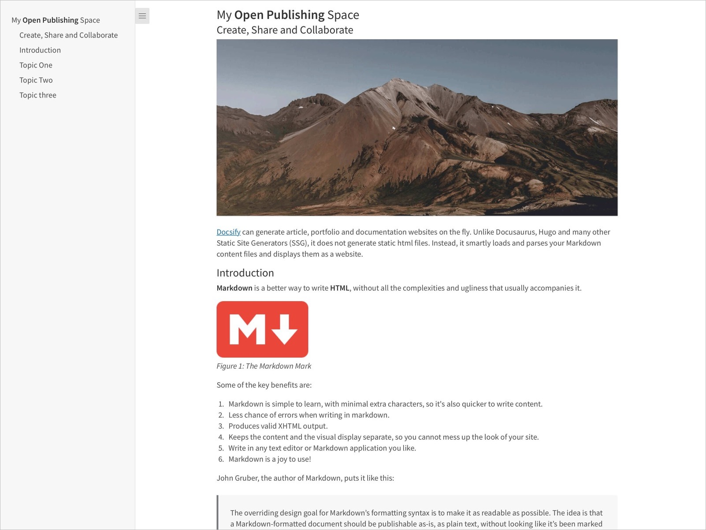
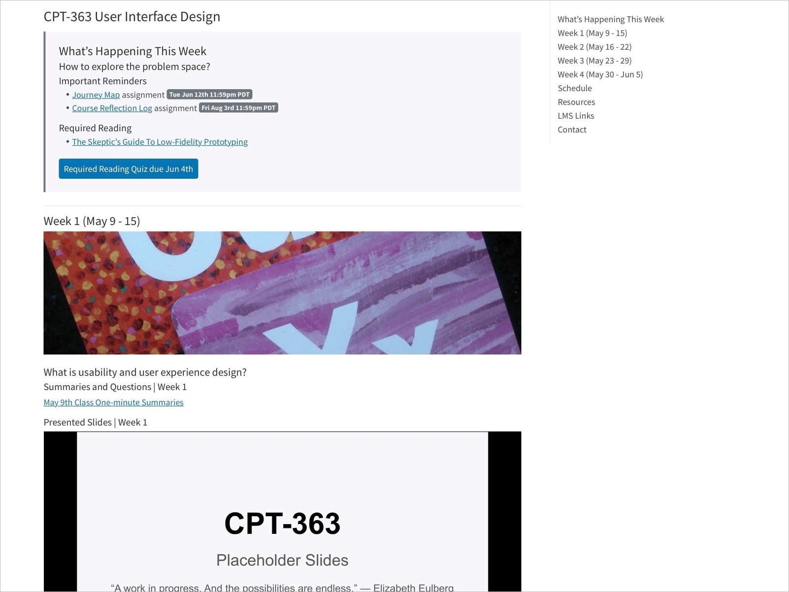
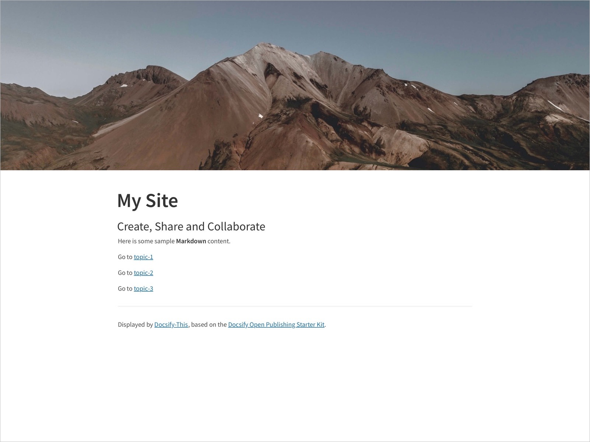
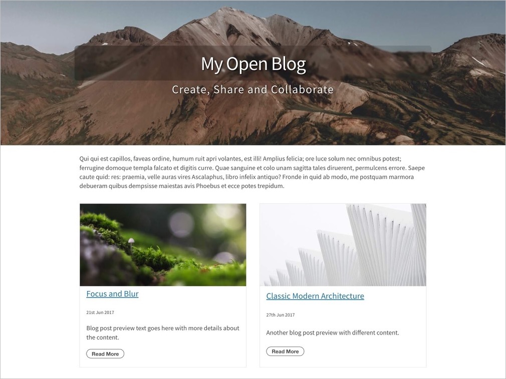
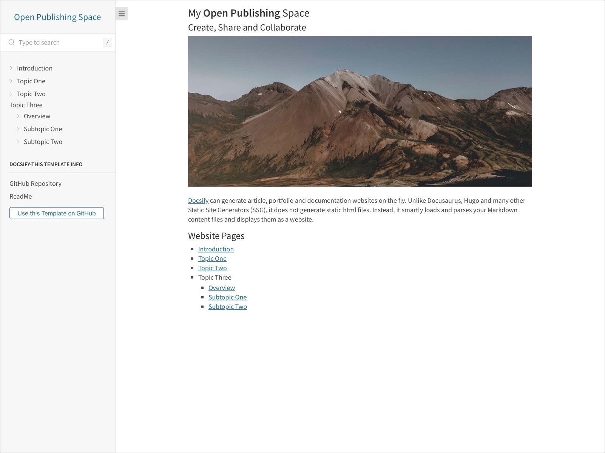
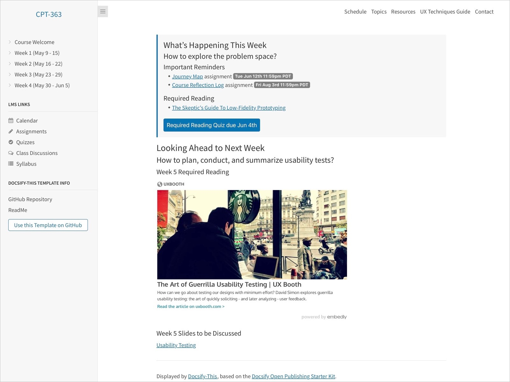
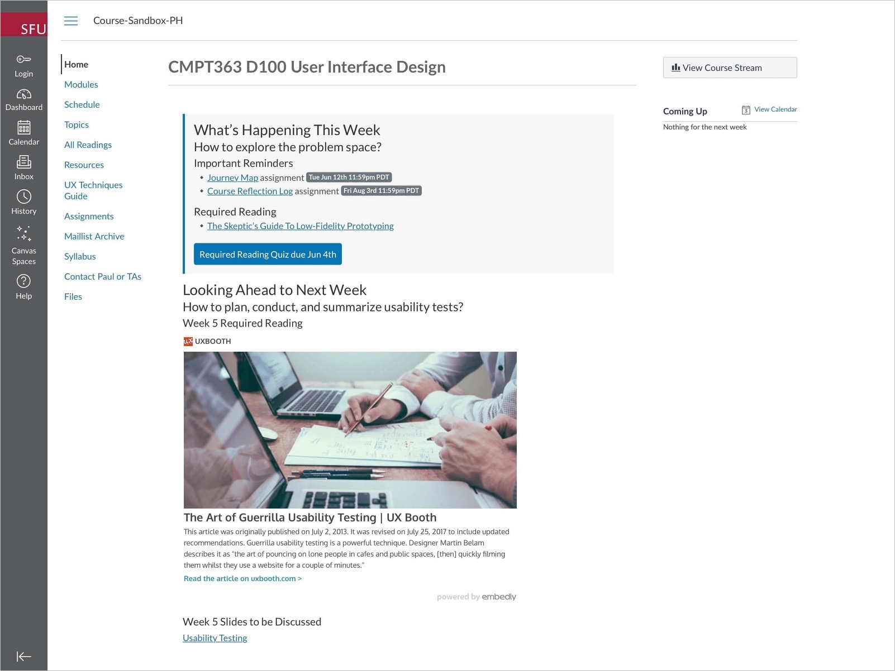

# Docsify-This

[](https://docsify.js.org/)
[](https://github.com/hibbitts-design/docsify-this/blob/main/LICENSE)
<a href="https://discord.gg/docsify">

</a>

## Instantly Turn Online Markdown Files into Web Pages

This open-source web app, built with magical documentation site generator [Docsify](https://docsify.js.org), makes [Markdown](https://en.wikipedia.org/wiki/Markdown) publishing as simple as providing a file link - publish single pages or entire websites with no webserver required.

<div style="display: none;">

_**Check out what Docsify-This can do by [viewing this ReadMe file as a web page with an optional Sidebar that includes headings up to 4 levels!](https://docsify-this.net?basePath=https://raw.githubusercontent.com/hibbitts-design/docsify-this/main&homepage=README.md&edit-link=https://github.com/hibbitts-design/docsify-this/blob/main/README.md&sidebar=true&browser-tab-title=Docsify-This%20ReadMe&edit-link-text=Suggest%20an%20Edit%20on%20GitHub&maxLevel=4&header-weight=600&zoom-images=true&dark-mode=auto)**_

</div>

<picture>
  <source srcset="https://raw.githubusercontent.com/paulhibbitts/github-repo-images/master/docsify-this-v1-10-6-web-page-builder-dark.png" media="(prefers-color-scheme: dark)">
  
</picture>
<p>
  <em>Figure 1. <a href="https://docsify-this.net">Docsify-This.net</a> Web Page Builder.</em>
</p>

### Quickstart ⚡

1. **Have a Markdown file online?** GitHub, Codeberg, or a public raw Markdown file works
1. Visit the location of your file and **copy the file URL**
1. **Visit** https://docsify-this.net and **paste that URL** into the Markdown File URL field
1. Choose a **Page layout** (try **Docsify Sidebar** for enhanced navigation)
1. Tap on the link  **Show More Page Appearance Options »** and select from available choices
1. Tap on the button **Publish as Web Page**

No online Markdown file handy? **Copy and paste this example URL** - an overview of the Markdown syntax:

```
https://github.com/hibbitts-design/markdown/blob/main/ReadMe.md
```

[See the above ReadMe file displayed with Docsify Sidebar and a searchbox, using the Merriweather font →](https://docsify-this.net/?basePath=https://raw.githubusercontent.com/hibbitts-design/markdown/main&homepage=ReadMe.md&sidebar=true&font-family=Merriweather,Georgia,serif&searchbox=true&dark-mode=auto)

> [!TIP]
> New to Markdown publishing? Check out the [Markdown Publishing with Docsify-This](https://docsify-this.net/?basePath=https://raw.githubusercontent.com/hibbitts-design/publishing-with-docsify-this/main&sidebar=true&searchbox=true&edit-link=https://github.com/hibbitts-design/publishing-with-docsify-this/blob/main/README.md&maxLevel=3&browser-tab-title=Markdown%20Publishing%20with%20Docsify-This&header-weight=600&dark-mode=auto) guide for step-by-step introduction.

## Everything You Need to Know about Docsify-This

<div style="display: none;">

<h3><a href="#1-introduction-and-overview-1">1. Introduction and Overview</a></h3>
<ul>
  <li><a href="#what-problem-does-docsify-this-solve">What Problem Does Docsify-This Solve?</a></li>
  <li><a href="#docsify-this-core-design-principles">Docsify-This Core Design Principles</a></li>
  <li><a href="#when-is-docsify-this-a-good-candidate">When is Docsify-This a Good Candidate?</a></li>
  <li><a href="#how-docsify-this-works">How Docsify-This Works</a></li>
  <li><a href="#read-what-people-are-saying-about-docsify-this">Read What People are Saying about Docsify-This</a></li>
  <li><a href="#see-what-people-are-doing-with-docsify-this">See What People are Doing with Docsify-This</a></li>
</ul>

<h3><a href="#2-publishing-with-docsify-this-1">2. Publishing with Docsify-This</a></h3>
<ul>
  <li><a href="#overview">Overview</a></li>
  <li><a href="#page-appearance-url-parameters-basic">Page Appearance URL Parameters (Basic)</a></li>
  <li><a href="#page-appearance-url-parameters-supplemental">Page Appearance URL Parameters (Supplemental)</a></li>
  <li><a href="#embedding-docsify-this-pages-into-other-platforms">Embedding Docsify-This Pages into Other Platforms</a></li>
  <li><a href="#ready-to-use-docsify-this-markdown-templates">Ready-to-Use Docsify-This Markdown Templates</a></li>
  <li><a href="#example-content-workflows">Example Content Workflows</a></li>
  <li><a href="#editing-docsify-this-markdown-files-on-your-desktop">Editing Docsify-This Markdown Files on your Desktop</a></li>
</ul>

<h3><a href="#3-customization-and-advanced-usage-1">3. Customization and Advanced Usage</a></h3>
<ul>
  <li><a href="#supported-markdown-css-classes">Supported Markdown CSS Classes</a></li>
  <li><a href="#custom-markdown-css-classes">Custom Markdown CSS Classes</a></li>
  <li><a href="#looking-for-even-more-customization-and-control">Looking for Even More Customization and Control?</a></li>
</ul>

<h3><a href="#4-reference-materials-and-project-resources-1">4. Reference Materials and Project Resources</a></h3>
<ul>
  <li><a href="#markdown-syntax-references">Markdown Syntax References</a></li>
  <li><a href="#font-awesome-icons">Font Awesome Icons</a></li>
  <li><a href="#additional-docsify-this-examples-and-templates">Additional Docsify-This Examples and Templates</a></li>
  <li><a href="#additional-docsify-this-learning-materials">Additional Docsify-This Learning Materials</a></li>
</ul>

<h3><a href="#5-tips-techniques-and-troubleshooting-1">5. Tips, Techniques, and Troubleshooting</a></h3>
<ul>
  <li><a href="#content-display-tips-and-techniques">Content Display Tips and Techniques</a></li>
  <li><a href="#making-a-markdown-file-available-online">Making a Markdown File Available Online</a></li>
  <li><a href="#improving-markdown-previews-in-text-editors">Improving Markdown Previews in Text Editors</a></li>
  <li><a href="#loading-web-page-builder-custom-settings">Loading Web Page Builder Custom Settings</a></li>
  <li><a href="#troubleshooting">Troubleshooting</a></li>
</ul>

<h3><a href="#6-support-and-policies-1">6. Support and Policies</a></h3>
<ul>
  <li><a href="#privacy-policy-summary">Privacy Policy Summary</a></li>
  <li><a href="#contact-and-support">Contact and Support</a></li>
</ul>

Have you tried out Docsify-This? Share your [feedback about Docsify-This](https://forms.gle/ViYu2ZdPmj6PeQ439)

---

</div>

### 1. Introduction and Overview

- [What Problem Does Docsify-This Solve?](#what-problem-does-docsify-this-solve)
- [Docsify-This Core Design Principles](#docsify-this-core-design-principles)
- [When is Docsify-This a Good Candidate?](#when-is-docsify-this-a-good-candidate)
- [How Docsify-This Works](#how-docsify-this-works)
- [Read What People are Saying about Docsify-This](#read-what-people-are-saying-about-docsify-this)
- [See What People are Doing with Docsify-This](#see-what-people-are-doing-with-docsify-this)

---

#### What Problem Does Docsify-This Solve?

Docsify-This provides a quick way to transform and style [Markdown content](https://www.markdownguide.org/basic-syntax/) into visually appealing web pages without requiring a website setup, build process, or in-depth technical knowledge. Designed for rapid, flexible content sharing, Docsify-This enables almost instant publishing and seamless content distribution across multiple platforms.  

With Docsify-This you can:

- Instantly publish online Markdown files as standalone web pages or even complete websites — no complex configuration required
- Maintain full control over your content by keeping files stored in their original locations, such as GitHub or Codeberg
- Customize web pages with a point-and-click Web Page Builder, avoiding the need for technical expertise or custom development
- Encourage collaboration with automatic ‘Edit this Page’ links for Markdown files hosted on GitHub or Codeberg, making it possible for collaborative authoring
- Embed constraint-free Markdown/HTML seamlessly into other platforms (LMS, CMS, etc.), enabling flexible content presentation and cross-platform integration
- Streamline content reuse by embedding Markdown files across platforms without duplication, reducing redundant workflows and boosting efficiency
- Tailor the appearance of embedded content dynamically using URL parameters, adapting it to suit the look and feel of each destination platform

---

#### Docsify-This Core Design Principles

- Zero Setup and Maintenance Publishing
- Separation of Content and Presentation 
- Platform independence and choice
- Your content, your control
- Support the 5 Rs of OER
- Authors helping other authors

---

### When is Docsify-This a Good Candidate?

#### Docsify-This often works really well when you:
- Want to embed the same content across multiple platforms (LMS, websites, etc.)
- Need cross-platform content reuse (same content for web, mobile, PDF and eBook generation)
- Want to publish open content quickly without technical setup
- Prefer minimal maintenance publishing (set it and forget it, no Webserver needed)
- Value simple, portable Markdown files with platform independence
- Are interested in using GitHub/Codeberg for version-control and collaboration
- Are creating educational materials, documentation, or research content

#### Other publishing tools might be better candidates when you:
- Require SEO optimization and search engine discoverability
- Need complex user management, approval workflows, or interactive features (contact forms, newsletters, user accounts)
- Want rich media features (e-commerce, forums, booking systems) or extensive visual customization
- Have multiple content types requiring different layouts (events, products, news, etc.)
- Are building large, complex websites with hundreds of pages
- Prefer visual page builders over Markdown editing

**Still unsure?** Docsify-This is designed for easy entry _and_ exit - try it with your content risk-free. Your Markdown files can be used by other tools if your needs change. For more powerful Markdown file-based publishing with hosting capabilities, explore the open-source [Grav CMS](https://getgrav.org/) project.

---

#### How Docsify-This Works

Docsify-This is a customized Docsify Open Publishing Starter Kit site configured to render remote Markdown files via URL parameters in the following format (automatically created by the Web Page Builder or by adding parameters directly after the source Markdown file URL):

`https://docsify-this.net?basePath=URLpath&homepage=filename.md`

The **basePath** Docsify parameter is the URL path containing the raw source Markdown file to render. If the file is named the expected default **README.md** then no other parameter are required, otherwise the **homepage** Docsify parameter must also be included set to the name of the file to render. An example Docsify-This URL would be:
https://docsify-this.net?basePath=https://raw.githubusercontent.com/hibbitts-design/docsify-this-one-page-article/main&homepage=home.md

Docsify-This can render files from anywhere that the content of a Markdown file can be viewed within a web browser, including:

- [GitHub.com](https://github.com/)(recommended) or [Codeberg.org](https://codeberg.org/) repository
- [GitHub Gist](https://gist.github.com/) (raw source URL required)
- Personal or organizational webhost
- _Or just about anywhere a raw source Markdown file can be accessed!_

To directly render a file stored in a public GitHub repository when not using the above Web Page Builder, you need to use the raw source URL of that file (i.e. raw.githubusercontent.com) by tapping the **Raw** button when [viewing a file](https://docs.github.com/en/repositories/working-with-files/using-files/viewing-a-file). It is also possible to render a file stored in a private GitHub repository by activating GitHub Pages within that repository and then using the GitHub Pages URL of that file (i.e. username.github.io).

The appearance of rendered Markdown files can be customized by optional [URL parameters](/?id=page-appearance-url-parameters-basic) and a small set of available [CSS Classes](/?id=supported-markdown-css-classes) within source Markdown files. In addition to supporting standard Markdown, [Embed.ly](https://embed.ly/code), [H5P](https://h5p.org/), [Latex](https://github.com/scruel/docsify-latex) and [Mermaid Diagrams](https://github.com/Leward/mermaid-docsify) are included. Optionally, page annotation with [Hypothes.is](https://hypothes.is) can be enabled.

Share-This.net is also available as an alias domain for non Docsify-This branded URLs, for example https://share-this.net?basePath=https://raw.githubusercontent.com/hibbitts-design/docsify-this-one-page-article/main&homepage=home.md.

Looking for an overall introduction to publishing with Docsify-This? Check out [Markdown Publishing with Docsify-This](https://docsify-this.net?basePath=https://raw.githubusercontent.com/hibbitts-design/publishing-with-docsify-this/main&sidebar=true&edit-link=https://github.com/hibbitts-design/publishing-with-docsify-this/blob/main/README.md&maxLevel=3&browser-tab-title=Markdown%20Publishing%20with%20Docsify-This&header-weight=600&dark-mode=auto).

Docsify-This uses client-side rendering, which means your content will not be indexed by search engines like Google, Bing, or DuckDuckGo.

---

#### Read What People are Saying about Docsify-This

> I’m blown away just by the fact you put a (Markdown file) URL into Docsify-This and then you get a URL back for a web page… done! Take the URL and go. It is so seamless.  
> — J. Groom, [Reclaim Today Episode 39](https://bavatuesdays.com/reclaim-today-explores-docsify-this/) (Co-founder, Reclaim Hosting)

> I've been using Docsify-This for my graduate publishing production course, partly to explore new models in markdown publishing, but partly also to tame Canvas, which I find awkward and cumbersome. Keeping all my course notes as plain text files and deploying them through Github and Docsify-this is easy and makes my course development a breeze. Plus, I keep all my materials locally, and can use re-use them without being reliant on Canvas.  
> — J. Maxwell (Director & Associate Professor in the Publishing Program at Simon Fraser University)

> Best tool I’ve found in years - this is one of those creations that is just done right, all the way to the core.  
> — D. Malawey (Multidisciplinary Lab Coordinator, Texas A&M University)

> Docsify-This has significantly improved my WordPress themes by being able to seamlessly embed into the interface the same documentation I use in the GitHub repository. This in turn has lead me to write better docs! I've barely scratched the surface of what Docsify-This can do as a simple-to-use web publishing tool.  
> — A. Levine aka CogDog (Independent Educational Technologist)

---

#### See What People are Doing with Docsify-This

Here are a few real-world examples of how educators and creators are using Docsify-This and/or its site templates:

- **[OpenLab Project Documentation](https://docsify-this.net?basePath=https://raw.githubusercontent.com/davidmalawey/openLab/main&homepage=home.md&edit-link=https://github.com/davidmalawey/openLab/blob/main&sidebar=true&browser-tab-title=OpenLab_Project&edit-link-top=true&hide-credits=true&loadFavicon=favicon.png&loadSidebar=_sidebar.md&loadNavbar=_navbar.md&name=OpenLab_Project&searchbox=true&page-title=OpenLab&mergeNavbar=true&zoom-images=true&dark-mode=true)** - Documented robotics prototyping lab at Texas A&M University
- **[Digital Literacy Course](https://docsify-this.net?basePath=https://raw.githubusercontent.com/harlows/TERTL509/main/modules/introduction&homepage=overview.md&browser-tab-title=TERTL509&hide-credits=true&sidebar=true&loadSidebar=_sidebar.md&loadFooter=_footer.md)** - Open university course on digital literacy, which adapts Ontario Extend OER content
- **[Intro to Software Engineering Course](https://docsify-this.net?basePath=https%3A%2F%2Fraw.githubusercontent.com%2FParsa-Rajabi%2FCMPT-276%2Fmain%2Fdocs&homepage=syllabus.md&sidebar=true&font-family=Lato%20Extended%2CLato%2CHelvetica%20Neue%2CHelvetica%2CArial%2Csans-serif&font-size=16px&link-color=cc0633&loadSidebar=_sidebar.md&name=CMPT_276&dark-mode=auto&link-color-dark-mode=ea7688)** - Docsify Starter Kit branded for SFU, as displayed by Docsify-This

BONUS: [What’s up, Doc? Docsifying the SPLOT Docs](https://cogdogblog.com/2022/08/docsifying-splot-docs/) - Blog post about using Docsify-This to provide one source of project documentation in multiple contexts.

x2 BONUS: [SFU CMPT-363 Canvas Course](https://canvas.sfu.ca/courses/69678) - Paul Hibbitts' past university course using [GitHub Markdown files](https://github.com/paulhibbitts/cmpt-363-222-pages) embedded within Canvas LMS pages

---

Docsify-This has been recognized as a finalist in the Open Infrastructure category for the [2024 Open Education Awards for Excellence](https://awards.oeglobal.org/2024-finalists/) — thank you to all Docsify.js.org maintainers and contributors, and to fellow open publishers, educators, and creators who share their open content with the rest of the world through Docsify-This.

---

### 2. Publishing with Docsify-This

- [Overview](#overview)
- [Page Appearance URL Parameters (Basic)](#page-appearance-url-parameters-basic)
- [Page Appearance URL Parameters (Supplemental)](#page-appearance-url-parameters-supplemental)
- [Embedding Docsify-This Pages into Other Platforms](#embedding-docsify-this-pages-into-other-platforms)
- [Ready-to-Use Docsify-This Markdown Templates](#ready-to-use-docsify-this-markdown-templates)
- [Example Content Workflows](#example-content-workflows)
- [Editing Docsify-This Markdown Files on your Desktop](#editing-docsify-this-markdown-files-on-your-desktop)

---

#### Overview

The visual appearance of an online Markdown file displayed as a web page by Docsify-This can be altered in the following ways:

- **Using the above Web Page Builder** — This point-and-click tool automatically generates the required Docsify-This URL with the necessary parameters
- **Adding parameters directly to the Markdown File URL field** — You can append URL parameters (like `&link-color=cc0000&font-size=16px`) in the Web Page Builder's URL field for quick customization
- **Manually adjusting URL parameters** — You can also manually modify the appearance by changing or adding specific parameters to the published Docsify-This URL

For example, to display the Markdown file located at https://raw.githubusercontent.com/hibbitts-design/docsify-this-one-page-article/main/home.md with a Docsify sidebar including headings up to 3 levels, the published Docsify-This URL would be:

```html
https://docsify-this.net?basePath=https://raw.githubusercontent.com/hibbitts-design/docsify-this-one-page-article/main&homepage=home.md&sidebar=true&maxLevel=3
```

And here’s how Docsify-This.net displays the same URL:


_The web page displayed by Docsify-This.net, showing the Markdown file with a sidebar that includes headings up to 3 levels, as specified by the Docsify-This URL._

#### Page Appearance URL Parameters (Basic)

Learn more about each of the basic Docsify-This URL parameters below, and discover what is possible when combining URL parameters and online Markdown files with a set of [ready-to-use Docsify-This markdown templates](#ready-to-use-docsify-this-markdown-templates).

**Basic URL Parameters (included in the standard Web Page Builder)**

- [browser-tab-title](#browser-tab-title)
- [edit-link](#edit-link)
- [edit-link-text](#edit-link-text)
- [edit-link-top](#edit-link-top)
- [font-family](#font-family)
- [font-size](/#font-size)
- [header-weight](#header-weight)
- [hide-credits](#hide-credits)
- [hypothesis](#hypothesis)
- [image-captions](#image-captions)
- [line-height](#line-height)
- [link-color](#link-color)
- [maxLevel](#maxLevel)
- [searchbox](#searchbox)
- [sidebar](/#sidebar)
- [toc](#toc)
- [toc-headings](#toc-headings)
- [toc-narrow](#toc-narrow)
- [zoom-images](#zoom-images)

##### browser-tab-title

Set a custom title on Browser tab for your web pages with the optional **browser-tab-title** parameter, for example:  
https://docsify-this.net?basePath=https://raw.githubusercontent.com/hibbitts-design/docsify-open-course-starter-kit/main/docs&homepage=resources.md&browser-tab-title=Resources. Please note to use titles with spaces they must be [encoded](https://meyerweb.com/eric/tools/dencoder/), so "My Page" would be "My%20Page". Underscores may also be used to represent spaces.

##### edit-link

Display a "Edit this Page" link (default location is bottom of page) with the optional **edit-link** parameter, for example:  
https://docsify-this.net?basePath=https://raw.githubusercontent.com/hibbitts-design/docsify-open-course-starter-kit/main&edit-link=https://github.com/hibbitts-design/docsify-open-publishing-starter-kit/blob/main/README.md

##### edit-link-text

Change the default text for a "Edit this Page" link with the optional **edit-link-text** parameter, for example:  
https://docsify-this.net?basePath=https://raw.githubusercontent.com/hibbitts-design/docsify-open-course-starter-kit/main&edit-link=https://github.com/hibbitts-design/docsify-open-publishing-starter-kit/blob/main/README.md&edit-link-text=View%20as%20Markdown. Please note to use text with spaces they must be [encoded](https://meyerweb.com/eric/tools/dencoder/), so "View as Markdown" would be "View%20as%20Markdown". Underscores may also be used to represent spaces.

##### edit-link-top

Change the location of the "Edit this Page" link from the bottom of pages to be the top of pages with the optional **edit-link-top** parameter, for example:  
https://docsify-this.net?basePath=https://raw.githubusercontent.com/hibbitts-design/docsify-open-course-starter-kit/main&toc=true&edit-link=https://github.com/hibbitts-design/docsify-open-publishing-starter-kit/blob/main/README.md&edit-link-top=true

##### font-family

Set a custom font for your web pages with the optional **font-family** parameter, for example:  
https://docsify-this.net?basePath=https://raw.githubusercontent.com/hibbitts-design/docsify-open-course-starter-kit/main/docs&homepage=resources.md&font-family=Helvetica,Arial,sans-serif. This parameter can be particularly valuable when trying to better match the visual presentation of embedded content with your destination platform. Please note to use fonts with spaces in their names they must be [encoded](https://meyerweb.com/eric/tools/dencoder/), so "Courier New" would be "Courier%20New". Underscores may also be used to represent spaces.

##### font-size

Set a custom font size for your web pages with the optional **font-size** parameter, for example:  
https://docsify-this.net?basePath=https://raw.githubusercontent.com/hibbitts-design/docsify-open-course-starter-kit/main/docs&homepage=resources.md&font-size=16px. This parameter can be particularly valuable when trying to better match the visual presentation of embedded content with your destination platform.

##### header-weight

Set a custom header font weight (default is 400 - regular) for your web pages with the optional **header-weight** parameter, for example:  
https://docsify-this.net?basePath=https://raw.githubusercontent.com/hibbitts-design/docsify-open-course-starter-kit/main/docs&homepage=resources.md&header-weight=600

##### hide-credits

Hide the credits usually shown at the bottom of every displayed Docsify-This page with the optional **hide-credits** parameter, for example:  
https://docsify-this.net?basePath=https://raw.githubusercontent.com/hibbitts-design/docsify-open-course-starter-kit/main/docs&homepage=resources.md&hide-credits=true

##### hypothesis

Enable page annotation with [Hypothes.is](https://hypothes.is) with the optional **hypothesis** parameter, for example:  
https://docsify-this.net?basePath=https://raw.githubusercontent.com/hibbitts-design/docsify-open-course-starter-kit/main/docs&homepage=resources.md&hypothesis=true

##### image-captions

Turn alt text into image captions (using the semantic HTML `<figure>` and `<figcaption>` structure) with the optional **image-captions** parameter, for example:  
https://docsify-this.net?basePath=https://raw.githubusercontent.com/hibbitts-design/docsify-this-one-page-article/main&homepage=home.md&image-captions=true

##### line-height

Set a custom line height for your web pages with the optional **line-height** parameter, for example:  
https://docsify-this.net?basePath=https://raw.githubusercontent.com/hibbitts-design/docsify-open-course-starter-kit/main/docs&homepage=resources.md&line-height=1.5

##### link-color

Set a custom color for all links, defined using the standard hexadecimal format _without the '#' symbol_ with the optional **link-color** parameter, for example:  
https://docsify-this.net?basePath=https://raw.githubusercontent.com/hibbitts-design/docsify-open-course-starter-kit/main/docs&homepage=resources.md&link-color=CC0000

##### maxLevel

Set the maximum header level of the Docsify sidebar with the optional **maxLevel** Docsify parameter, for example:  
https://docsify-this.net?basePath=https://raw.githubusercontent.com/hibbitts-design/docsify-open-publishing-starter-kit/main/docs&homepage=introduction.md&sidebar=true&maxLevel=3

##### searchbox

Enable the Docsify Search plugin (which currently includes matches for text and markup) on multiple page sites including a Sidebar with the optional **searchbox** Docsify parameter, for example:  
https://docsify-this.net?basePath=https://raw.githubusercontent.com/hibbitts-design/docsify-this-multiple-page-course-site/main&homepage=home.md&sidebar=true&loadSidebar=_sidebar.md&loadNavbar=_navbar.md&searchbox=true

##### sidebar

Display a Docsify sidebar with the optional **sidebar** parameter, for example:  
https://docsify-this.net?basePath=https://raw.githubusercontent.com/hibbitts-design/docsify-open-course-starter-kit/main&sidebar=true

##### toc

Display a page table of contents with the optional **toc** parameter, for example:  
https://docsify-this.net?basePath=https://raw.githubusercontent.com/hibbitts-design/docsify-open-publishing-starter-kit/main/docs&homepage=introduction.md&toc=true

##### toc-headings

Set the page heading levels (i.e. h1, h2, etc.) to be included in the Page Table of Contents with the optional **toc-headings** parameter, for example:  
https://docsify-this.net?basePath=https://raw.githubusercontent.com/hibbitts-design/docsify-open-publishing-starter-kit/main/docs&homepage=introduction.md&toc=true&toc-headings=h1,h2,h3

##### toc-narrow

Use a less wide Page Table of Contents with the optional **toc-narrow** parameter, for example:  
https://docsify-this.net?basePath=https://raw.githubusercontent.com/hibbitts-design/docsify-open-publishing-starter-kit/main/docs&homepage=introduction.md&toc-narrow=true. This parameter can be particularly valuable when embedding content where a smaller screen area is likely.

##### zoom-images

Enable image zoom (tapping on page images to enlarge them) with the optional **zoom-images** Docsify parameter, for example:  
https://docsify-this.net?basePath=https://raw.githubusercontent.com/hibbitts-design/docsify-this-markdown-content-demo/main&zoom-images=true. To exclude images, use ``.

#### Page Appearance URL Parameters (Supplemental)

The following additional URL parameters are available for use in Docsify-This URLs, and are included in the [Advanced Web Page Builder](https://docsify-this.net?advanced=true) unless otherwise indicated.

**Supplemental URL Parameters (included in the Advanced Web Page Builder)**

- [back-link](#back-link)
- [coverpage](#coverpage)
- [coverpage-color](#coverpage-color)
- [coverpage-color-dark-mode](#coverpage-color-dark-mode)
- [dark-mode](#dark-mode)
- [edit-link-emoji](#edit-link-emoji)
- [image-captions-font-style](#image-captions-font-style)
- [image-captions-image-align](#image-captions-image-align)
- [image-captions-text-align](#image-captions-text-align)
- [link-color-dark-mode](#link-color-dark-mode)
- [link-color-hover](#link-color-hover)
- [link-color-hover-dark-mode](#link-color-hover-dark-mode)
- [link-text-decoration](#link-text-decoration)
- [link-text-decoration-hover](#link-text-decoration-hover)
- [loadFavicon](#loadFavicon)
- [loadFooter](#loadFooter)
- [loadNavbar](#loadNavbar)
- [loadSidebar](#loadSidebar)
- [logo](#logo)
- [max-width](#max-width)
- [mergeNavbar](#mergeNavbar)
- [name](#name)
- [page-title](#page-title)
- [pagination](#pagination)
- [submaxLevel](#subMaxLevel)
- [svg-icons](#svg-icons)

##### back-link

Add a custom back link to other sites at the top of your web pages with the optional back-link parameter, for example:  
https://docsify-this.net?basePath=https://raw.githubusercontent.com/hibbitts-design/docsify-this-one-page-article/main&homepage=home.md&back-link=https://docsify-this.net?basePath=https://raw.githubusercontent.com/hibbitts-design/docsify-this-one-page-course/main+homepage=home.md+sidebar=true. Please note that since & is used to separate URL parameters, any & characters within the back-link URL must be replaced with + characters.

##### coverpage

Display a [Docsify custom coverpage](https://docsify.js.org/#/configuration?id=coverpage) with the optional **coverpage** parameter, for example:  
https://docsify-this.net?basePath=https://raw.githubusercontent.com/hibbitts-design/docsify-open-publishing-starter-kit/main/docs&homepage=home.md&coverpage=_coverpage.md

##### coverpage-color

Set a custom color for the coverpage with the optional **coverpage-color** parameter, for example:  
https://docsify-this.net?basePath=https://raw.githubusercontent.com/hibbitts-design/docsify-open-publishing-starter-kit/main/docs&homepage=home.md&coverpage=_coverpage.md&coverpage-color=FF9E9E

##### coverpage-color-dark-mode

Set a custom color for the coverpage in dark mode with the optional **coverpage-color-dark-mode** parameter, for example:  
https://docsify-this.net?basePath=https://raw.githubusercontent.com/hibbitts-design/docsify-open-publishing-starter-kit/main/docs&homepage=home.md&dark-mode=auto&link-color=CC0000&link-color-dark-mode=FF9E9E&coverpage=_coverpage.md&coverpage-color=FF9E9E&coverpage-color-dark-mode=4d0000

##### dark-mode

Enable dark theme or automatically switch light/dark theme based on system OS-level preference with the optional **dark-mode** parameter, for example:  
https://docsify-this.net?basePath=https://raw.githubusercontent.com/hibbitts-design/docsify-open-publishing-starter-kit/main/docs&homepage=introduction.md&dark-mode=auto

##### edit-link-emoji

Change the default [emoji](https://preview.docsifyjs.org/#/emoji) for a "Edit this Page" link with the optional **edit-link-emoji** parameter (not included in the Advanced Web Page Builder), for example:  
https://docsify-this.net?basePath=https://raw.githubusercontent.com/hibbitts-design/docsify-this-multiple-page-open-publishing-site/main&homepage=home.md&edit-link=https://github.com/hibbitts-design/docsify-this-multiple-page-open-publishing-site/blob/main&edit-link-text=View%20on%20GitHub&sidebar=true&loadSidebar=_sidebar.md&searchbox=true&name=Open%20Publishing%20Space&edit-link-emoji=:file_folder: with a folder icon and link to a GitHub repository and https://docsify-this.net?basePath=https://raw.githubusercontent.com/hibbitts-design/docsify-this-one-page-article/main&homepage=home.md&edit-link=https://raw.githubusercontent.com/hibbitts-design/docsify-this-one-page-article/refs/heads/main/home.md&edit-link-text=View%20as%20Markdown&edit-link-top=true&edit-link-emoji=page_facing_up: with a page icon and link to the raw Markdown

##### image-captions-font-style

Set the font style of image captions with the optional **image-captions-font-style** parameter (not included in the Advanced Web Page Builder), for example:  
https://docsify-this.net?basePath=https://raw.githubusercontent.com/hibbitts-design/docsify-this-one-page-article/main&homepage=home.md&image-captions=true&image-captions-font-style=normal

##### image-captions-image-align

Align image caption images with the optional **image-captions-image-align** parameter (not included in the Advanced Web Page Builder), for example:  
https://docsify-this.net?basePath=https://raw.githubusercontent.com/hibbitts-design/docsify-this-one-page-article/main&homepage=home.md&image-captions=true&image-captions-text-align=right&image-captions-image-align=right

##### image-captions-text-align

Align image caption text with the optional **image-captions-text-align** parameter (not included in the Advanced Web Page Builder), for example:  
https://docsify-this.net?basePath=https://raw.githubusercontent.com/hibbitts-design/docsify-this-one-page-article/main&homepage=home.md&image-captions=true&image-captions-image-align=center&image-captions-text-align=center

##### lazy-load-images

Enable the lazy loading of images by Browsers with the optional **lazy-load-images** parameter (not included in the Advanced Web Page Builder), for example:  
https://docsify-this.net?basePath=https://raw.githubusercontent.com/hibbitts-design/docsify-open-publishing-starter-kit/main/docs&homepage=introduction.md&lazy-load-images=true Please note that enabling lazy loading of images may affect page scroll accuracy, for example by the Docsify Sidebar etc.

##### link-color-dark-mode

Set a custom color for all links in dark mode, defined using the standard hexadecimal format _without the '#' symbol_ with the optional **link-color-dark-mode** parameter, for example:  
https://docsify-this.net?basePath=https://raw.githubusercontent.com/hibbitts-design/docsify-open-course-starter-kit/main/docs&homepage=resources.md&link-color=CC0000&dark-mode=auto&link-color-dark-mode=FF9E9E

##### link-color-hover

Set a custom hover color for all links, defined using the standard hexadecimal format _without the '#' symbol_ with the optional **link-color-hover** parameter, for example:  
https://docsify-this.net?basePath=https://raw.githubusercontent.com/hibbitts-design/docsify-open-course-starter-kit/main/docs&homepage=resources.md&link-color-hover=CC0000

##### link-color-hover-dark-mode

Set a custom hover color for all links in dark mode, defined using the standard hexadecimal format _without the '#' symbol_ with the optional **link-color-hover-dark-mode** parameter, for example:  
https://docsify-this.net?basePath=https://raw.githubusercontent.com/hibbitts-design/docsify-open-course-starter-kit/main/docs&homepage=resources.md&link-color=CC0000&dark-mode=auto&link-color-hover-dark-mode=FF9E9E

##### link-text-decoration

Set a custom text decoration for all links, with the optional **link-text-decoration** parameter, for example:  
https://docsify-this.net?basePath=https://raw.githubusercontent.com/hibbitts-design/docsify-open-course-starter-kit/main/docs&homepage=resources.md&link-text-decoration=none

##### link-text-decoration-hover

Set a custom hover text decoration for all links, with the optional **link-text-decoration-hover** parameter, for example:  
https://docsify-this.net?basePath=https://raw.githubusercontent.com/hibbitts-design/docsify-open-course-starter-kit/main/docs&homepage=resources.md&link-text-decoration-hover=underline

##### loadFavicon

You can set a custom Favicon from the image file passed from the optional **loadFavicon** parameter, for example:  
https://docsify-this.net?basePath=https://raw.githubusercontent.com/hibbitts-design/docsify-this-markdown-content-demo/main&loadFavicon=open-access.png

##### loadFooter

Load a Docsify footer from the Markdown file in the current directory passed with the optional **loadFooter** Docsify parameter, for example:  
https://docsify-this.net?basePath=https://raw.githubusercontent.com/hibbitts-design/docsify-open-publishing-starter-kit/main/docs&homepage=introduction.md&loadFooter=_footer.md

##### loadNavbar

Load a [Docsify custom navbar](https://docsify.js.org/#/custom-navbar?id=custom-navbar) from the Markdown file passed with the optional **loadNavbar** Docsify parameter, for example:  
https://docsify-this.net?basePath=https://raw.githubusercontent.com/hibbitts-design/docsify-open-publishing-starter-kit/main/docs&homepage=introduction.md&loadNavbar=_navbar.md

##### loadSidebar

Load a [Docsify custom sidebar](https://docsify.js.org/#/more-pages?id=sidebar) from the Markdown file passed with the optional **loadSidebar** Docsify parameter, for example:  
https://docsify-this.net?basePath=https://raw.githubusercontent.com/paulhibbitts/docsify-this-cmpt-363-222-site/main&homepage=home.md&sidebar=true&loadSidebar=_sidebar.md

##### logo

Display a logo image for the website in a Docsify custom Sidebar (i.e. file 'logo.png) with the optional **logo** Docsify parameter, for example:  
https://docsify-this.net?basePath=https://raw.githubusercontent.com/hibbitts-design/docsify-this-multiple-page-course-site/main&homepage=home.md&sidebar=true&loadSidebar=_sidebar.md&loadNavbar=_navbar.md&name=CPT-363&logo=/images/logo.png The full folder path and filename must be provided. A website name must also be provided, and will be used as the alt text for the logo.

##### max-width

Set a custom max width for content of your web pages with the optional **max-width** parameter (not included in the Advanced Web Page Builder), for example:  
https://docsify-this.net?basePath=https://raw.githubusercontent.com/hibbitts-design/docsify-this-one-page-article/main&homepage=home.md&core-theme-styles=true&max-width=100. If no unit is included the default unit is percentage (%). You can also specify other units like max-width=910px.

##### mergeNavbar

Merge the Navbar items to the top of the sidebar on smaller screens with the optional **mergeNavbar** Docsify parameter, for example:
https://docsify-this.net?basePath=https://raw.githubusercontent.com/hibbitts-design/docsify-this-multiple-page-course-site/main&homepage=home.md&sidebar=true&loadSidebar=_sidebar.md&loadNavbar=_navbar.md&mergeNavbar=true&name=CPT-363

##### name

Display the name for the website in a Docsify custom Sidebar (i.e. file '\_sidebar.md) with the optional **name** Docsify parameter, for example:  
https://docsify-this.net?basePath=https://raw.githubusercontent.com/hibbitts-design/docsify-this-multiple-page-course-site/main&homepage=home.md&sidebar=true&loadSidebar=_sidebar.md&loadNavbar=_navbar.md&searchbox=true&name=CPT-363. When this parameter is provided it will be automatically used as the Browser tab title as well. Please note to use names with spaces they must be [encoded](https://meyerweb.com/eric/tools/dencoder/), so "My Site" would be "My%20Site". Underscores may also be used to represent spaces.

##### page-title

Add a custom page title at the top of your web pages with the optional **page-title** parameter, for example:  
https://docsify-this.net?basePath=https://raw.githubusercontent.com/hibbitts-design/grav-skeleton-course-hub/refs/heads/master/pages/03.resources&homepage=page.md&page-title=Resources. Please note to use titles with spaces they must be [encoded](https://meyerweb.com/eric/tools/dencoder/), so "My Page" would be "My%20Page". Underscores may also be used to represent spaces.

##### pagination

Display Pagination buttons in page content area (Docsify custom Sidebar required) with the optional **pagination** parameter, for example:  
https://docsify-this.net?basePath=https://raw.githubusercontent.com/hibbitts-design/docsify-this-multiple-page-course-site/main&homepage=home.md&sidebar=true&loadSidebar=_sidebar.md&loadNavbar=_navbar.md&searchbox=true&pagination=true

##### subMaxLevel

Set the maximum automatic table of contents header levels in Docsify custom Sidebar (i.e. file '\_sidebar.md) with the optional **subMaxLevel** Docsify parameter, for example:  
https://docsify-this.net?basePath=https://raw.githubusercontent.com/hibbitts-design/docsify-this-multiple-page-course-site/main&homepage=home.md&sidebar=true&loadSidebar=_sidebar.md&subMaxLevel=1

##### svg-icons

Use the SVG version of Font Awesome icons instead of Web Fonts with the optional **svg-icons** parameter (not included in the Advanced Web Page Builder), for example:  
https://docsify-this.net?basePath=https://raw.githubusercontent.com/hibbitts-design/docsify-this-lms-content-pages/main&homepage=schedule.md&svg-icons=true

---

#### Embedding Docsify-This Pages into Other Platforms

A [fully responsive Docsify-This page can be embedded into an iFrame](https://demo.hibbittsdesign.org/embedded-docsify-this-iframe/).

_In general, paste the below HTML into your HTML editor and then replace the default `basepath` and `homepage` value with your own. For WordPress users: Add the code below to a Custom HTML block._

For basic embedding with a fixed height to seamlessly integrate with other destination page content:

```html
<div style="width: 100%; margin: 0; padding: 0; overflow: hidden;">
  <iframe src="https://docsify-this.net/?basePath=https://raw.githubusercontent.com/paulhibbitts/github-demo-markdown-file/main&homepage=README.md&max-width=100&hide-credits=true" 
    style="width: 100%; height: 2700px; border: none; display: block;"
    scrolling="no"
    frameborder="0">
  </iframe>
</div>
```

_Adjust the `height` value (2700px) to match your content length. Test on different devices to ensure all content is visible._

To avoid having to determine and set an appropriate height for the iframe, a scrollbar can be included:

```html
<div style="width: 100%; height: 80vh; margin: 0; padding: 0; overflow: hidden; border: 1px solid #e5e7eb; border-radius: 8px;">
    <iframe src="https://docsify-this.net/?basePath=https://raw.githubusercontent.com/paulhibbitts/github-demo-markdown-file/main&homepage=README.md&hide-credits=true" 
      style="width: 100%; height: 100%; border: none; display: block;"
      frameborder="0">
    </iframe>
</div>
```

##### Canvas LMS

[Embed content in Canvas](https://www.howtocanvas.com/create-amazing-pages-in-canvas/embedding-content)  
iFrame code example, including URL parameters to seamlessly match Docsify-This content to Canvas:

```html
<p>
  <iframe style="overflow: hidden; border: 0px #ffffff none; background: #ffffff;"
    src="https://docsify-this.net?basePath=https://raw.githubusercontent.com/paulhibbitts/cmpt-363-222-pages/main&homepage=home.md&font-family=Lato%20Extended,Lato,Helvetica%20Neue,Helvetica,Arial,sans-serif&font-size=16px&hide-credits=true"
      width="800px"
      height="1400px"
      allowfullscreen="allowfullscreen">
  </iframe>
</p>
```

_If a scrollbar is present and not desired, you may want to re-edit your iFrame code and adjust the `height` value._

[How do I add an external URL as a module item?](https://community.canvaslms.com/t5/Instructor-Guide/How-do-I-add-an-external-URL-as-a-module-item/ta-p/967)  
Module external link example, with Page Table of Contents:

```html
https://docsify-this.net?basePath=https://raw.githubusercontent.com/paulhibbitts/cmpt-363/main/docs/222&homepage=week-02.md&toc-narrow=true&font-family=Lato%20Extended,Lato,Helvetica%20Neue,Helvetica,Arial,sans-serif&font-size=16px&hide-credits=true
```

[Creating a custom link in your course navigation using the Redirect Tool](https://help.canvas.yale.edu/m/55452/l/914676-creating-a-custom-link-in-your-course-navigation-using-the-redirect-tool)  
Redirect URL field example:

```html
https://docsify-this.net?basePath=https://raw.githubusercontent.com/paulhibbitts/cmpt-363-222-pages/main&homepage=resources.md&edit-link=https://github.com/paulhibbitts/cmpt-363-222-pages/blob/main/resources.md&font-family=Lato%20Extended,Lato,Helvetica%20Neue,Helvetica,Arial,sans-serif&font-size=16px&hide-credits=true
```

##### Moodle LMS

[iFrame (for embedding content within pages)](https://docs.moodle.org/401/en/Iframe)

[External tool (for adding a link to course navigation or elements)](https://docs.moodle.org/401/en/External_tool)

---

#### Ready-to-Use Docsify-This Markdown Templates

While all you need to get going with Docsify-This is a basic Markdown file, below are some templates you can use that show what is possible with Markdown, images, URL parameters, and even a few HTML snippets!

To use these templates you would generally do the following (template specific instructions are included with each template):

1.  Sign in to [GitHub](https://github.com), or create an account if you don’t already have one.

2.  Tap **Use this template** in the chosen template repository (upper-right green button) and then choose **Create a new repository**

3.  Choose the name for your new repository to contain the files and then tap **Create repository** to copy the template files to your own GitHub account

4.  View an included Markdown file, for example **home.md**, and copy its URL.

5.  Go to https://docsify-this.net and paste the copied URL into the **Markdown File URL** field

6.  Select the page options you want (e.g. Docsify Sidebar) and tap the **Publish as a Web Page** button to view your Markdown file as a web page for sharing or embedding

To edit a file in GitHub, tap the **Pencil** icon (Edit file) in the upper-right when viewing the file, make your changes, and then tap the **Commit changes...** button to save those changes.

**Available Docsify-This Markdown Templates**

- [One Page Article Template](#one-page-article-template)
- [One Page Course Template](#one-page-course-template)
- [Multiple Page Basic Site Template](#multiple-page-basic-site-template)
- [Multiple Page Blog Style Site Template](#multiple-page-blog-style-site-template)  <span class="badge" style="--badge-bg-color: #22c55e;">NEW</span>
- [Multiple Page Open Publishing Site Template](#multiple-page-open-publishing-site-template)  <span class="badge" style="--badge-bg-color: #22c55e;">NEW</span>
- [Multiple Page Course Site Template](#multiple-page-course-site-template)
- [LMS Content Pages Template](#lms-content-pages-template)

##### One Page Article Template



[One Page Article Template](https://github.com/hibbitts-design/docsify-this-one-page-article) with [home.md](https://github.com/hibbitts-design/docsify-this-one-page-article/blob/main/home.md) file displayed by Docsify-This as a:

- [Web Page](https://docsify-this.net?basePath=https://raw.githubusercontent.com/hibbitts-design/docsify-this-one-page-article/main&homepage=home.md "Docsify-This One Page Article Template - Web Page")
- [Web Page with Table of Contents including h2 and h3 Headers and an 'Edit this Page' link](https://docsify-this.net?basePath=https://raw.githubusercontent.com/hibbitts-design/docsify-this-one-page-article/main&homepage=home.md&toc=true&toc-headings=h2,h3&edit-link=https://github.com/hibbitts-design/docsify-this-one-page-article/blob/main/home.md "Docsify-This One Page Article Template - Web Page with Table of Contents")
- [Web Page with Docsify Sidebar with maxLevel of 3 (H3) and an 'Edit this Page' link](https://docsify-this.net?basePath=https://raw.githubusercontent.com/hibbitts-design/docsify-this-one-page-article/main&homepage=home.md&sidebar=true&maxLevel=3&edit-link=https://github.com/hibbitts-design/docsify-this-one-page-article/blob/main/home.md "Docsify-This One Page Article Template - Web Page with Docsify Sidebar")
- [Web Page with Docsify Sidebar with maxLevel of 3 (H3) and a 'View as Markdown' link at top of page with custom emoji](https://docsify-this.net?basePath=https://raw.githubusercontent.com/hibbitts-design/docsify-this-one-page-article/main&homepage=home.md&sidebar=true&maxLevel=3&edit-link=https://raw.githubusercontent.com/hibbitts-design/docsify-this-one-page-article/refs/heads/main/home.md&edit-link-text=View%20as%20Markdown&edit-link-emoji=:page_facing_up:&edit-link-top=true "Docsify-This One Page Article Template - Web Page with Docsify Sidebar")

##### One Page Course Template



[One Page Course Template](https://github.com/hibbitts-design/docsify-this-one-page-course) with [home.md](https://github.com/hibbitts-design/docsify-this-one-page-course/blob/main/home.md) file displayed by Docsify-This as a:

- [Web Page](https://docsify-this.net?basePath=https://raw.githubusercontent.com/hibbitts-design/docsify-this-one-page-course/main&homepage=home.md "Docsify-This One Page Course Template - Web Page")
- [Web Page with Table of Contents and an 'Edit this Page' link](https://docsify-this.net?basePath=https://raw.githubusercontent.com/hibbitts-design/docsify-this-one-page-course/main&homepage=home.md&toc=true&edit-link=https://github.com/hibbitts-design/docsify-this-one-page-course/blob/main/home.md "Docsify-This One Page Course Template - Web Page with Table of Contents")
- [Web Page with Docsify Sidebar and an 'Edit this Page' link](https://docsify-this.net?basePath=https://raw.githubusercontent.com/hibbitts-design/docsify-this-one-page-course/main&homepage=home.md&sidebar=true&edit-link=https://github.com/hibbitts-design/docsify-this-one-page-course/blob/main/home.md "Docsify-This One Page Course Template - Web Page with Docsify Sidebar")

##### Multiple Page Basic Site Template



[Multiple Page Basic Site Template](https://github.com/hibbitts-design/docsify-this-multiple-page-basic-site) with [home.md](https://github.com/hibbitts-design/docsify-this-multiple-page-basic-site/blob/main/home.md) file and a range of page content examples, including the use of the Markdown CSS class `header-image-full-width`, displayed by Docsify-This as:

- [Website](https://docsify-this.net?basePath=https://raw.githubusercontent.com/hibbitts-design/docsify-this-multiple-page-basic-site/main&homepage=home.md "Docsify-This Multiple Page Basic Site - Website")
- [Website using the Merriweather font](https://docsify-this.net?basePath=https://raw.githubusercontent.com/hibbitts-design/docsify-this-multiple-page-basic-site/main&homepage=home.md&font-family=Merriweather,Georgia,serif "Docsify-This Multiple Page Basic Site - Website using the Merriweather font")
- [Website using the Merriweather font and red links](https://docsify-this.net?basePath=https://raw.githubusercontent.com/hibbitts-design/docsify-this-multiple-page-basic-site/main&homepage=home.md&font-family=Merriweather,Georgia,serif&link-color=CC0000 "Docsify-This Multiple Page Basic Site - Website using the Merriweather font and red links")
- [Website and 'Edit this Page' links](https://docsify-this.net?basePath=https://raw.githubusercontent.com/hibbitts-design/docsify-this-multiple-page-basic-site/main&homepage=home.md&edit-link=https://github.com/hibbitts-design/docsify-this-multiple-page-basic-site/blob/main/home.md "Docsify-This Multiple Page Basic Site - Website with 'Edit this Page' link")
- [Website and 'Edit this Page' links using the Merriweather font](https://docsify-this.net?basePath=https://raw.githubusercontent.com/hibbitts-design/docsify-this-multiple-page-basic-site/main&homepage=home.md&edit-link=https://github.com/hibbitts-design/docsify-this-multiple-page-basic-site/blob/main/home.md&font-family=Merriweather,Georgia,serif "Docsify-This Multiple Page Basic Site - Website with 'Edit this Page' link using the Merriweather font")
- [Website with Footer and an 'Edit this Page' link](https://docsify-this.net?basePath=https://raw.githubusercontent.com/hibbitts-design/docsify-this-multiple-page-basic-site/main&homepage=home.md&loadFooter=_footer&edit-link=https://github.com/hibbitts-design/docsify-this-multiple-page-basic-site/blob/main/home.md "Docsify-This Multiple Page Basic Site - Website with Footer and an 'Edit this Page' link")
- [Website with 'GitHub Repository' link](https://docsify-this.net?basePath=https://raw.githubusercontent.com/hibbitts-design/docsify-this-multiple-page-basic-site/main&homepage=home.md&edit-link=https://github.com/hibbitts-design/docsify-this-multiple-page-basic-site&edit-link-text=GitHub%20Repository "Docsify-This Multiple Page Basic Site - Website with 'GitHub Repository' link")

##### Multiple Page Blog Style Site Template



[Multiple Page Blog Style Site Template](https://github.com/hibbitts-design/docsify-this-multiple-page-blog-style-site) with [home.md](https://github.com/hibbitts-design/docsify-this-multiple-page-blog-style-site/blob/main/home.md) file, including the use of a responsive card list created with HTML div elements and the Markdown CSS class `header-image-full-width-headings-overlay`, displayed by Docsify-This as:

- [Website](https://docsify-this.net?basePath=https://raw.githubusercontent.com/hibbitts-design/docsify-this-multiple-page-blog-style-site/main&homepage=home.md "Docsify-This Multiple Page Blog Style Site - Website")
- [Website using the Merriweather font](https://docsify-this.net?basePath=https://raw.githubusercontent.com/hibbitts-design/docsify-this-multiple-page-blog-style-site/main&homepage=home.md&font-family=Merriweather,Georgia,serif "Docsify-This Multiple Page Blog Style Site - Website using the Merriweather font")
- [Website using the Merriweather font and red links](https://docsify-this.net?basePath=https://raw.githubusercontent.com/hibbitts-design/docsify-this-multiple-page-blog-style-site/main&homepage=home.md&font-family=Merriweather,Georgia,serif&link-color=CC0000 "Docsify-This Multiple Page Blog Style Site - Website using the Merriweather font and red links")
- [Website and 'Edit this Page' links](https://docsify-this.net?basePath=https://raw.githubusercontent.com/hibbitts-design/docsify-this-multiple-page-blog-style-site/main&homepage=home.md&edit-link=https://github.com/hibbitts-design/docsify-this-multiple-page-blog-style-site/blob/main/home.md "Docsify-This Multiple Page Blog Style Site - Website with 'Edit this Page' link")

##### Multiple Page Open Publishing Site Template



[Multiple Page Open Publishing Site Template](https://github.com/hibbitts-design/docsify-this-multiple-page-open-publishing-site) with [home.md](https://github.com/hibbitts-design/docsify-this-multiple-page-open-publishing-site/blob/main/home.md) file, including the use of a Docsify custom [Sidebar](https://github.com/hibbitts-design/docsify-this-multiple-page-open-publishing-site/blob/main/_sidebar.md) file, displayed by Docsify-This as:

- [Website with Docsify Sidebar](https://docsify-this.net?basePath=https://raw.githubusercontent.com/hibbitts-design/docsify-this-multiple-page-open-publishing-site/main&homepage=home.md&sidebar=true&loadSidebar=_sidebar.md&hide-credits=true "Docsify-This Multiple Page Open Publishing Site - Website with Docsify Sidebar")
- [Website with Docsify Sidebar showing only H1 headers](https://docsify-this.net?basePath=https://raw.githubusercontent.com/hibbitts-design/docsify-this-multiple-page-open-publishing-site/main&homepage=home.md&sidebar=true&loadSidebar=_sidebar.md&subMaxLevel=1&hide-credits=true "Docsify-This Multiple Page Open Publishing Site - Website with Docsify Sidebar only showing level 1 headers")
- [Website with Docsify Sidebar and Navbar](https://docsify-this.net?basePath=https://raw.githubusercontent.com/hibbitts-design/docsify-this-multiple-page-open-publishing-site/main&homepage=home.md&sidebar=true&loadSidebar=_sidebar.md&loadNavbar=_navbar.md&hide-credits=true "Docsify-This Multiple Page Open Publishing Site - Website with Docsify Sidebar and Navbar")
- [Website with Docsify Sidebar and Search](https://docsify-this.net?basePath=https://raw.githubusercontent.com/hibbitts-design/docsify-this-multiple-page-open-publishing-site/main&homepage=home.md&sidebar=true&loadSidebar=_sidebar.md&searchbox=true&hide-credits=true "Docsify-This Multiple Page Open Publishing Site - Website with Docsify Sidebar and Search")
- [Website with Docsify Sidebar, Search and website name](https://docsify-this.net?basePath=https://raw.githubusercontent.com/hibbitts-design/docsify-this-multiple-page-open-publishing-site/main&homepage=home.md&sidebar=true&loadSidebar=_sidebar.md&searchbox=true&name=Open%20Publishing%20Space&hide-credits=true "Docsify-This Multiple Page Open Publishing Site - Website with Docsify Sidebar and Search")
- [Website with Docsify Sidebar, Pagination buttons, Search and website name](https://docsify-this.net?basePath=https://raw.githubusercontent.com/hibbitts-design/docsify-this-multiple-page-open-publishing-site/main&homepage=home.md&sidebar=true&loadSidebar=_sidebar.md&pagination=true&searchbox=true&name=Open%20Publishing%20Space&hide-credits=true "Docsify-This Multiple Page Open Publishing Site - Website with Docsify Sidebar, Pagination buttons, Search and website name")
- [Website with Docsify Sidebar, Search, 'Propose an Edit to this Site' link and a website name](https://docsify-this.net?basePath=https://raw.githubusercontent.com/hibbitts-design/docsify-this-multiple-page-open-publishing-site/main&homepage=home.md&edit-link=https://github.com/hibbitts-design/docsify-this-multiple-page-open-publishing-site/blob/main&edit-link-text=Propose%20an%20Edit%20to%20this%20Site&sidebar=true&loadSidebar=_sidebar.md&searchbox=true&name=Open%20Publishing%20Space&hide-credits=true "Docsify-This Multiple Page Open Publishing Site - Website with Docsify Sidebar, 'Propose an Edit to this Site' link and a website name")
- [Website with Docsify Sidebar, Search, 'Propose an Edit to this Site' link, website name and a Coverpage](https://docsify-this.net?basePath=https://raw.githubusercontent.com/hibbitts-design/docsify-this-multiple-page-open-publishing-site/main&homepage=home.md&edit-link=https://github.com/hibbitts-design/docsify-this-multiple-page-open-publishing-site/blob/main&edit-link-text=Propose%20an%20Edit%20to%20this%20Site&sidebar=true&loadSidebar=_sidebar.md&searchbox=true&coverpage=_coverpage.md&name=Open%20Publishing%20Space&hide-credits=true "Docsify-This Multiple Page Open Publishing Site - Website with Docsify Sidebar, 'Propose an Edit to this Site' link , website name and a Coverpage")

##### Multiple Page Course Site Template



[Multiple Page Course Site Template](https://github.com/hibbitts-design/docsify-this-multiple-page-course-site) with [home.md](https://github.com/hibbitts-design/docsify-this-multiple-page-course-site/blob/main/home.md) file, including the use of a Docsify custom [Sidebar](https://github.com/hibbitts-design/docsify-this-multiple-page-course-site/blob/main/_sidebar.md) file and Docsify custom [Navbar](https://github.com/hibbitts-design/docsify-this-multiple-page-course-site/blob/main/_navbar.md) file, displayed by Docsify-This as:

- [Website](https://docsify-this.net?basePath=https://raw.githubusercontent.com/hibbitts-design/docsify-this-multiple-page-course-site/main&homepage=home.md&sidebar=true&loadSidebar=_sidebar.md&name=CPT-363&loadNavbar=_navbar.md&hide-credits=true&browser-tab-title=CPT-363 "Docsify-This Multiple Page Course Site - Website")
- [Website with custom Favicon](https://docsify-this.net?basePath=https://raw.githubusercontent.com/hibbitts-design/docsify-this-multiple-page-course-site/main&homepage=home.md&sidebar=true&loadSidebar=_sidebar.md&name=CPT-363&loadNavbar=_navbar.md&loadFavicon=favicon.png&hide-credits=true&browser-tab-title=CPT-363 "Docsify-This Multiple Page Course Site - Website")
- [Website with logo](https://docsify-this.net?basePath=https://raw.githubusercontent.com/hibbitts-design/docsify-this-multiple-page-course-site/main&homepage=home.md&sidebar=true&loadSidebar=_sidebar.md&name=CPT-363&loadNavbar=_navbar.md&loadFavicon=favicon.png&hide-credits=true&browser-tab-title=CPT-363&logo=images/logo.png "Docsify-This Multiple Page Course Site - Website with logo")
- [Website with Search](https://docsify-this.net?basePath=https://raw.githubusercontent.com/hibbitts-design/docsify-this-multiple-page-course-site/main&homepage=home.md&sidebar=true&loadSidebar=_sidebar.md&name=CPT-363&loadNavbar=_navbar.md&loadFavicon=favicon.png&hide-credits=true&browser-tab-title=CPT-363&logo=images/logo.png&searchbox=true "Docsify-This Multiple Page Course Site - Website with Search")
- [Website with Pagination buttons](https://docsify-this.net?basePath=https://raw.githubusercontent.com/hibbitts-design/docsify-this-multiple-page-course-site/main&homepage=home.md&sidebar=true&loadSidebar=_sidebar.md&name=CPT-363&loadNavbar=_navbar.md&hide-credits=true&browser-tab-title=CPT-363&pagination=true "Docsify-This Multiple Page Course Site - Website with Pagination buttons")
- [Website with a 'Propose an Edit to this Site' link](https://docsify-this.net?basePath=https://raw.githubusercontent.com/hibbitts-design/docsify-this-multiple-page-course-site/main&homepage=home.md&edit-link=https://github.com/hibbitts-design/docsify-this-multiple-page-course-site/blob/main&edit-link-text=Propose%20an%20Edit%20to%20this%20Site&sidebar=true&loadSidebar=_sidebar.md&name=CPT-363&loadNavbar=_navbar.md&hide-credits=true&browser-tab-title=CPT-363 "Docsify-This Multiple Page Course Site - Website with a 'Propose an Edit to this Site' link")
- [Website with Footer and a 'Propose an Edit to this Site' link](https://docsify-this.net?basePath=https://raw.githubusercontent.com/hibbitts-design/docsify-this-multiple-page-course-site/main&homepage=home.md&edit-link=https://github.com/hibbitts-design/docsify-this-multiple-page-course-site/blob/main&edit-link-text=Propose%20an%20Edit%20to%20this%20Site&sidebar=true&loadSidebar=_sidebar.md&name=CPT-363&loadNavbar=_navbar.md&hide-credits=true&loadFooter=_footer.md&browser-tab-title=CPT-363 "Docsify-This Multiple Page Course Site - Website with Footer and a 'Propose an Edit to this Site' link")

##### LMS Content Pages Template



[LMS Content Pages Template](https://github.com/hibbitts-design/docsify-this-lms-content-pages) example pages, including the use of the `font-family`, `font-size` and `hide-credits` URL parameters for seamless content embedding within the Canvas LMS, as displayed by Docsify-This:

- [Embeddable Home Page](https://docsify-this.net?basePath=https://raw.githubusercontent.com/hibbitts-design/docsify-this-lms-content-pages/main&homepage=home.md&font-family=Lato%20Extended,%20Lato,Helvetica%20Neue,%20Helvetica,%20Arial,%20sans-serif&font-size=16px&hide-credits=true "Embeddable Home Page")
- [Embeddable Weekly Module Page](https://docsify-this.net?basePath=https://raw.githubusercontent.com/hibbitts-design/docsify-this-lms-content-pages/main&homepage=module-01.md&font-family=Lato%20Extended,%20Lato,Helvetica%20Neue,%20Helvetica,%20Arial,%20sans-serif&font-size=16px&hide-credits=true "Embeddable Weekly Module Page")
- [Embeddable Schedule Page](https://docsify-this.net?basePath=https://raw.githubusercontent.com/hibbitts-design/docsify-this-lms-content-pages/main&homepage=schedule.md&font-family=Lato%20Extended,%20Lato,Helvetica%20Neue,%20Helvetica,%20Arial,%20sans-serif&font-size=16px&hide-credits=true "Embeddable Schedule Page")
- [Embeddable Topics Page](https://docsify-this.net?basePath=https://raw.githubusercontent.com/hibbitts-design/docsify-this-lms-content-pages/main&homepage=topics.md&font-family=Lato%20Extended,%20Lato,Helvetica%20Neue,%20Helvetica,%20Arial,%20sans-serif&font-size=16px&hide-credits=true "Embeddable Topics Page")
- [Embeddable Resources Page](https://docsify-this.net?basePath=https://raw.githubusercontent.com/hibbitts-design/docsify-this-lms-content-pages/main&homepage=resources.md&font-family=Lato%20Extended,%20Lato,Helvetica%20Neue,%20Helvetica,%20Arial,%20sans-serif&font-size=16px&hide-credits=true "Embeddable Resource Page")
- [Embeddable UX Techniques Guide Page (using Accordion format)](https://docsify-this.net?basePath=https://raw.githubusercontent.com/hibbitts-design/docsify-this-lms-content-pages/main&homepage=ux-techniques-guide.md&font-family=Lato%20Extended,%20Lato,Helvetica%20Neue,%20Helvetica,%20Arial,%20sans-serif&font-size=16px&hide-credits=true "Embeddable UX Techniques Guide Page (using Accordion format)")
- [Embeddable Contact Page](https://docsify-this.net?basePath=https://raw.githubusercontent.com/hibbitts-design/docsify-this-lms-content-pages/main&homepage=contact.md&font-family=Lato%20Extended,%20Lato,Helvetica%20Neue,%20Helvetica,%20Arial,%20sans-serif&font-size=16px&hide-credits=true "Embeddable Contact Page")

View an example Canvas LMS site using Docsify-This content at https://canvas.sfu.ca/courses/76692.

---

#### Example Content Workflows

<div class="row">
<div class="column">

  
_Docsify-This.net open and collaborative workflow using GitHub Markdown files._

</div>
<div class="column">


_Docsify-This.net workflow using Webserver Markdown files._

</div>
</div>

---

#### Editing Docsify-This Markdown Files on your Desktop

When using Docsify-This to display Markdown files located on Git-based services such as GitHub or Codeberg you can download (clone) files to your desktop for local editing and then upload (push) changes back to the online files.

For example, to edit GitHub Markdown files on your desktop you would do the following:

1. Tap **Code** on your GitHub Markdown files repository (upper-right green button)
2. Choose **Open Desktop** and follow the prompts, installing [GitHub Desktop](https://desktop.github.com/) if not already present
3. You will now be able to edit the Docsify-This Markdown files using the desktop text editor of your choice such as [Microsoft Visual Studio](https://code.visualstudio.com/), [Pulsar](https://pulsar-edit.dev/) (was Atom.io), [Typora](https://typora.io/) etc.
4. Use GitHub Desktop to push any changes to your repository.

[Learn more about getting started with GitHub Desktop](https://docs.github.com/en/desktop/overview/getting-started-with-github-desktop).

---

### 3. Customization and Advanced Usage

- [Supported Markdown CSS Classes](#supported-markdown-css-classes)
- [Custom Markdown CSS Classes](#custom-markdown-css-classes)
- [Looking for Even More Customization and Control?](#looking-for-even-more-customization-and-control)

---

#### Supported Markdown CSS Classes

- [accordion](#accordion)
- [badge](#badge)
- [banner-image](#banner-image)
- [banner-tall-image](#banner-tall-image)
- [button](#button)
- [button-rounded](#button-rounded)
- [button-secondary](#button-secondary)
- [button-secondary-rounded](#button-secondary-rounded)
- [card](#card)
- [card-list](#card-list)
- [card-rounded](#card-rounded)
- [embedly-card](#embedly-card)
- [header-image-fade](#header-image-fade)
- [header-image-full-width](#header-image-full-width)
- [header-tall-image-full-width](#header-tall-image-full-width)
- [header-image-full-width-headings-overlay](#header-image-full-width-headings-overlay)
- [header-tall-image-full-width-headings-overlay](#header-tall-image-full-width-headings-overlay)
- [image-75/image-50/image-25](/#image-75image-50image-25)
- [image-75-border/image-50-border/image-25-border](#image-75-borderimage-50-borderimage-25-border)
- [image-border](#image-border)
- [image-border-rounded](#image-border-rounded)
- [navpill](#navpill)
- [responsive](#responsive)
- [row/column](#rowcolumn)
- [video-container-4by3](#video-container-4by3)
- [video-container-16by9](#video-container-16by9)

The following CSS classes are available when authoring your own Markdown content.

##### accordion

```html
<div class="accordion">
  <details>
    <summary>Topic One</summary>

    Topic one details here.
  </details>

  <details>
    <summary>Topic Two</summary>

    Topic two details here.
  </details>
</div>
```

##### badge

```html
<span class="badge"> Tue Jun 12th 11:59pm PDT</span>
```

```html
<span class="badge" style="--badge-bg-color: #0164db;">
  Tue Jun 12th 11:59pm PDT</span>
```

```html
<span
  class="badge"
  style="--badge-bg-color: #e7c500; --badge-text-color: #000;">
  Tue Jun 12th 11:59pm PDT</span>
```

```html
<span class="badge">
  [Tue May 16 2:30pm
  PT](https://www.timeanddate.com/worldclock/fixedtime.html?msg=CMPT-363+Blackboard+Mini-lectures+and+Activities&iso=20220516T1430&p1=256&ah=1&am=50)</span>
```

##### banner-image

Cropped to height of 250px on large screens, 125px on small screens.

```markdown

```

##### banner-tall-image

Cropped to height of 350px on large screens, 175px on small screens.

```markdown

```

##### button

```markdown
[Required Reading Quiz due Jun 4th](https://canvas.sfu.ca/courses/44038/quizzes/166553 ":class=button")
```

```markdown
[:fa fa-download fa-fw:Download](https://creativecommons.org/wp-content/uploads/2019/02/ccheart_black.svg_.zip ":class=button")
```

```html
<a
  class="button"
  href="https://creativecommons.org/wp-content/uploads/2019/02/ccheart_black.svg_.zip"
  target="_blank"
  ><i class="fa fa-download fa-fw"></i>Download</a
>
```

##### button-rounded

```markdown
[Required Reading Quiz due Jun 4th](https://canvas.sfu.ca/courses/44038/quizzes/166553 ":class=button-rounded")
```

```markdown
[:fa fa-download fa-fw:Download](https://creativecommons.org/wp-content/uploads/2019/02/ccheart_black.svg_.zip ":class=button-rounded")
```

```html
<a
  class="button-rounded"
  href="https://creativecommons.org/wp-content/uploads/2019/02/ccheart_black.svg_.zip"
  target="_blank"
  ><i class="fa fa-download fa-fw"></i>Download</a
>
```

##### button-secondary

```markdown
[Required Reading Quiz due Jun 4th](https://canvas.sfu.ca/courses/44038/quizzes/166553 ":class=button-secondary")
```

```markdown
[:fa fa-download fa-fw:Download](https://creativecommons.org/wp-content/uploads/2019/02/ccheart_black.svg_.zip ":class=button")
```

```html
<a
  class="button-secondary"
  href="https://creativecommons.org/wp-content/uploads/2019/02/ccheart_black.svg_.zip"
  target="_blank"
  ><i class="fa fa-download fa-fw"></i>Download</a
>
```

##### button-secondary-rounded

```markdown
[Required Reading Quiz due Jun 4th](https://canvas.sfu.ca/courses/44038/quizzes/166553 ":class=button-secondary-rounded")
```

```markdown
[:fa fa-download fa-fw:Download](https://creativecommons.org/wp-content/uploads/2019/02/ccheart_black.svg_.zip ":class=button-secondary-rounded")
```

```html
<a
  class="button-secondary-rounded"
  href="https://creativecommons.org/wp-content/uploads/2019/02/ccheart_black.svg_.zip"
  target="_blank"
  ><i class="fa fa-download fa-fw"></i>Download</a
>
```

##### card

```html
<div class="card">

  ## [Card Title](#)
  
  Card content goes here.

</div>
```

##### card-list

```html
<div class="card-list">
 <div class="card">

 ## [Blog Post Title Link](#)
 

 Blog post preview text goes here with more details about the content.  

 Jan 1, 1970. 

 [Read More](# ":class=navpill")

 </div>
 <div class="card">

 ## [Another Blog Post](#)
 

 Another blog post preview with different content.  

 Jan 1, 1970. 

 [Read More](# ":class=navpill")
    
 </div>
</div>
```

##### card-rounded

```html
<div class="card-rounded">

  ## [Card Title](#)
  
  Card content goes here.

</div>
```

##### embedly-card

For linked article previews, embedded slides/videos, etc.

```html
<a
  class="embedly-card"
  data-card-controls="0"
  data-card-align="left"
  href="https://blog.prototypr.io/defining-usability-e7bf42e8abd0"
  >Defining usability</a
>
```

##### header-image-fade

Suggested width of 1200px to 2000px.

```markdown

```

##### header-image-fade-full-width

Suggested width of 1200px to 2000px, and display of Table of Contents or 'Edit this Page' links at top of page are not available.

```markdown

```

##### header-image-full-width

Suggested size of 1200px to 2000px width and 400px to 600px height, and display of Table of Contents or 'Edit this Page' links at top of page are not available. H1 and H2 headings immediately following the image receive enhanced typography styling.

```markdown

```

##### header-tall-image-full-width

Suggested size of 1200px to 2000px width and 400px to 600px height, and display of Table of Contents or 'Edit this Page' links at top of page are not available. H1 and H2 headings immediately following the image receive enhanced typography styling.

```markdown

```

##### header-image-full-width-headings-overlay

Suggested size of 1200px to 2000px width and 400px to 600px height, and display of Table of Contents or 'Edit this Page' links at top of page are not available. H1 and H2 headings immediately following the image are positioned as overlays on the image.

```markdown


# Page Title
```

##### header-tall-image-full-width-headings-overlay

Suggested size of 1200px to 2000px width and 400px to 600px height, and display of Table of Contents or 'Edit this Page' links at top of page are not available. H1 and H2 headings immediately following the image are positioned as overlays on the image.

```markdown


# Page Title
```

##### image-75/image-50/image-25

Scale images to %.

```markdown

```

##### image-75-border/image-50-border/image-25-border

Scale images with border to %.

```markdown

```

##### image-border

```markdown

```

##### image-border-rounded

```markdown

```

##### navpill

```markdown
[GitHub](https://github.com/hibbitts-design/docsify-this ":class=navpill")
```

```markdown
[:fab fa-github fa-fw:GitHub](https://github.com/hibbitts-design/docsify-this ":class=navpill")
```

```html
<a class="navpill" href="https://github.com" target="_blank"
  ><i class="fab fa-github fa-fw"></i>GitHub</a
>
```

##### responsive

Make raw HTML images that include size dimensions responsive.

```html

```

##### row/column

```html
<div class="row">
  <div class="column">
    Lorem ipsum dolor sit amet, consectetur adipiscing elit.
  </div>
  <div class="column">
    Lorem ipsum dolor sit amet, consectetur adipiscing elit.
  </div>
</div>
```

##### row/column with reversed column order

```html
<div class="row reverse-columns">
  <div class="column">
    Lorem ipsum dolor sit amet, consectetur adipiscing elit.
  </div>
  <div class="column">
    Lorem ipsum dolor sit amet, consectetur adipiscing elit.
  </div>
</div>
```

##### row/column with right-aligned second column

```html
<div class="row">
  <div class="column">
    Lorem ipsum dolor sit amet, consectetur adipiscing elit.
  </div>
  <div class="column-right">
    Lorem ipsum dolor sit amet, consectetur adipiscing elit.
  </div>
</div>
```

##### video-container-4by3

```html
<div class="video-container-4by3">
  <div class="video-container-16by9">
    <iframe
      width="560"
      height="315"
      src="https://www.youtube.com/embed/lJIrF4YjHfQ"></iframe>
  </div>
</div>
```

##### video-container-16by9

Automatically added to all iFrames with the source domains 'youtube.com' or 'docs.google.com'.

```html
<div class="video-container-16by9">
  <iframe
    width="560"
    height="315"
    src="https://www.youtube.com/embed/lJIrF4YjHfQ"></iframe>
</div>
```

---

#### Custom Markdown CSS Classes

In addition to the Markdown CSS classes supported by Docsify-This, you can also define your own custom classes within your displayed Markdown files, for example:

CSS in Markdown file:

```css
<style>
.markdown-section .mybutton, .markdown-section .mybutton:hover {
  cursor: pointer;
  color: #CC0000;
  height: auto;
  display: inline-block;
  border: 2px solid #CC0000;
  border-radius: 4rem;
  margin: 2px 0px 2px 0px;
  padding: 8px 18px 8px 18px;
  line-height: 1.2rem;
  background-color: white;
  font-family: -apple-system, "Segoe UI", "Helvetica Neue", sans-serif;
  font-weight: bold;
  text-decoration: none;
}
</style>
```

Markdown:

```markdown
[Required Reading Quiz due Jun 4th](https://canvas.sfu.ca/courses/44038/quizzes/166553 ":class=mybutton")
```

---

#### Looking for Even More Customization and Control?

Docsify-This was designed to quickly and easily display one or more remotely hosted Markdown files. For greater customization of file rendering and to ensure consistent availability, even if the public Docsify-This.net instance was no longer available, you can host your own instance of Docsify-This.

##### GitHub Instance

To host your own instance on GitHub Pages, which also supports the option of a custom domain, fork or clone the [Docsify-This](https://github.com/hibbitts-design/docsify-this) repository to your GitHub account. Then, enable GitHub Pages using the `/docs` folder.

##### Codeberg Instance

You can also have an instance of Docsify-This run on [Codeberg](https://codeberg.org/) such as https://docsify-this.codeberg.page by creating a new repository called `pages`, then choosing **paulhibbitts/docsify-this-app** in the **template** dropdown menu, choosing the **Git Content (Default Branch)** option and then tapping the **Create Repository** button.

Alternatively, you can upload the files in the Docsify-This `/docs` folder into a newly created Codeberg repository and then manually enable [Codeberg Pages](https://docs.codeberg.org/codeberg-pages/). An example Docsify-This instance running on Codeberg is available at https://codeberg.org/paulhibbitts/docsify-this-app, which uses a Branch renamed to `pages`.

##### Webserver Instance

If you want to run Docsify-This on your own Websever, create a destination folder on your server and then copy the files within the Docsify-This folder `/docs` to your newly created server folder. You could also use this `docs` folder as a custom domain root.

A more future-friendly setup would be to fork the Docsify-This repository (to support getting upstream updates) and use a GitHub Action such as [FTP-Deploy](https://github.com/SamKirkland/FTP-Deploy-Action) to deploy all changed repository files to a webserver.

##### Limiting File Domains

You can limit the domains which remote files can be rendered from by locating the line `var allowedDomains = '';` within the `index.html` file and include your list of allowed domains separated by commas, for example `var allowedDomains = 'codeberg.org,raw.githubusercontent.com,hibbittsdesign.org';`.

##### Advanced Customization

If you want to further customize and control the presentation of your Markdown content, especially when rendering multiple page sites, you can install your own [Docsify Open Publishing Starter Kit](https://github.com/hibbitts-design/docsify-open-publishing-starter-kit) (that this hosted web app is based on) and store all Markdown files within that site. You can learn more about the capabilities of Docsify itself at [Docsify.js.org](https://docsify.js.org).

Looking for some help with getting a Docsify custom-This instance up and running for your organization? Paul provides a range of professional services related to Docsify-This - [contact him to learn more](https://docsify-this.net/#/?id=contact-and-support).

---

### 4. Reference Materials and Project Resources

- [Markdown Syntax References](#markdown-syntax-references)
- [Font Awesome Icons](#font-awesome-icons)
- [Additional Docsify-This Examples and Templates](#additional-docsify-this-examples-and-templates)
- [Additional Docsify-This Learning Materials](#additional-docsify-this-learning-materials)

---

#### Markdown Syntax References

- [What Is Markdown, and How Do You Use It?](https://www.howtogeek.com/448323/what-is-markdown-and-how-do-you-use-it/)
- [Markdown Cheatsheet](https://github.com/adam-p/markdown-here/wiki/Markdown-Cheatsheet)
- [Markdown Guide](https://www.markdownguide.org/)

---

#### Font Awesome Icons

The display of [Font Awesome Free](https://fontawesome.com/icons) icons within Markdown content is supported with the following format:

:`fas fa-home fa-fw`:

The above Markdown is equivalent to the HTML markup `<i class="fas fa-home fa-fw" aria-hidden="true"></i>`.

When using the above shortcode for Font Awesome icons, it is assumed to be for decorative purposes, and so for improved accessibility an `aria-hidden="true"` attribute is automatically added to the icon. For semantic purposes, it is recommended you refer to the [Font Awesome Icons and Accessibility](https://docs.fontawesome.com/web/dig-deeper/accessibility) guidelines.

The following style prefixes are available with Docsify-This:

- fas (i.e. [Solid](https://fontawesome.com/search?o=r&m=free&s=solid))
- fab (i.e. [Brands](https://fontawesome.com/search?o=r&m=free&f=brands))

---

#### Additional Docsify-This Examples and Templates

- [Examples](/?id=examples)
- [Templates](/?id=templates)

##### Examples

**Educational/Academic Content**

_GitHub Training Manual Working Locally with Git_  
[GitHub Training Manual Working Locally with Git Markdown file](https://github.com/githubtraining/training-manual/blob/main/docs/06_working_locally.md), displayed by Docsify-This as a:

- [Web Page](https://docsify-this.net?basePath=https://raw.githubusercontent.com/githubtraining/training-manual/main/docs&homepage=06_working_locally.md "GitHub Training Manual Working Locally with Git - Web Page")
- [Web Page with Table of Contents](https://docsify-this.net?basePath=https://raw.githubusercontent.com/githubtraining/training-manual/main/docs&homepage=06_working_locally.md&toc=true&toc-headings=h2,h3 "GitHub Training Manual Working Locally with Git - Web Page with Table of Contents")
- [Web Page with Docsify Sidebar](https://docsify-this.net?basePath=https://raw.githubusercontent.com/githubtraining/training-manual/main/docs&homepage=06_working_locally.md&sidebar=true&maxLevel=3 "GitHub Training Manual Working Locally with Git - Web Page with Docsify Sidebar")

[A Collection of GitHub Markdown files with inline CSS](https://github.com/paulhibbitts/docsify-this-cmpt-363-222-site) used as a [multiple page SFU CMPT-363 course site with SFU visual branding and the Docsify Search plugin enabled](https://docsify-this.net?basePath=https://raw.githubusercontent.com/paulhibbitts/docsify-this-cmpt-363-222-site/main&homepage=home.md&loadNavbar=_navbar.md&sidebar=true&loadSidebar=_sidebar.md&loadFavicon=favicon.png&dark-mode=auto&name=CMPT-363-222&searchbox=true#/course-welcome), [multiple page SFU CMPT-363 course site with SFU visual branding and website logo](https://docsify-this.net?basePath=https://raw.githubusercontent.com/paulhibbitts/docsify-this-cmpt-363-222-site/main&homepage=home.md&loadNavbar=_navbar.md&sidebar=true&loadSidebar=_sidebar.md&loadFavicon=favicon.png&dark-mode=auto&name=CMPT-363-222&logo=images/logo.png#/course-welcome), an example [single Markdown file for embeddeding styled via URL parameters](https://docsify-this.net?basePath=https://raw.githubusercontent.com/paulhibbitts/docsify-this-cmpt-363-222-site/main&homepage=home.md&link-color=CC0633&link-text-decoration=none&link-text-decoration-hover=underline&hide-credits=true#/course-welcome) and an example [single Markdown file with for embeddeding into Canvas styled via URL parameters](https://docsify-this.net?basePath=https://raw.githubusercontent.com/paulhibbitts/docsify-this-cmpt-363-222-site/main&homepage=home.md&font-family=Lato%20Extended,Lato,Helvetica%20Neue,Helvetica,Arial,sans-serif&font-size=16px&hide-credits=true#/course-welcome).

**General Documentation & Websites**  

_Easy Markdown to Github Pages_  
[Easy Markdown to Github Pages linked set of Markdown files](https://github.com/nicolas-van/easy-markdown-to-github-pages), displayed by Docsify-This as:

- [Website](https://docsify-this.net?basePath=https://raw.githubusercontent.com/nicolas-van/easy-markdown-to-github-pages/master&homepage=README.md "Easy Markdown to Github Pages - Web Page")
- [Website with Table of Contents and an 'Edit this Page' link](https://docsify-this.net?basePath=https://raw.githubusercontent.com/nicolas-van/easy-markdown-to-github-pages/master&homepage=README.md&toc=true&edit-link=https://github.com/nicolas-van/easy-markdown-to-github-pages/blob/master/README.md "Easy Markdown to Github Pages - Web Page with Table of Contents")
- [Website with Docsify Sidebar and an 'Edit this Page' link](https://docsify-this.net?basePath=https://raw.githubusercontent.com/nicolas-van/easy-markdown-to-github-pages/master&homepage=README.md&sidebar=true&edit-link=https://github.com/nicolas-van/easy-markdown-to-github-pages/blob/master/README.md "Easy Markdown to Github Pages - Web Page with Docsify Sidebar")

_Markdown Content Demos_  
[Standard and GitHub Flavored Markdown file](https://github.com/paulhibbitts/demo-markdown-file/blob/main/README.md), displayed by Docsify-This as a [Web Page with 'View raw Markdown' link](https://docsify-this.net?basePath=https://raw.githubusercontent.com/paulhibbitts/demo-markdown-file/main&edit-link=https://raw.githubusercontent.com/paulhibbitts/demo-markdown-file/main/README.md&edit-link-text=View%20raw%20Markdown).

[Standard and GitHub Flavored Markdown Demo Codeberg file](https://codeberg.org/paulhibbitts/demo-markdown-file/src/branch/main/README.md), displayed by Docsify-This as a [Web Page with 'View raw Markdown' link](https://docsify-this.net/?basePath=https://raw.codeberg.page/paulhibbitts/demo-markdown-file&homepage=README.md&edit-link=https://codeberg.org/paulhibbitts/demo-markdown-file/raw/branch/main/README.md&edit-link-text=View%20raw%20Markdown).

[Docsify-This Markdown CSS Styles & Embeds Demo file](https://github.com/hibbitts-design/docsify-this-markdown-content-demo/blob/main/README.md), displayed by Docsify-This as a [Web Page with 'Edit this Page' link](https://docsify-this.net?basePath=https://raw.githubusercontent.com/hibbitts-design/docsify-this-markdown-content-demo/main&homepage=README.md&edit-link=https://github.dev/hibbitts-design/docsify-this-markdown-content-demo/blob/main/README.md) using the new [GitHub.dev web editor](https://docs.github.com/en/codespaces/the-githubdev-web-based-editor) (currently in Beta).

[Docsify-This Markdown CSS Styles & Embeds Demo file](https://github.com/hibbitts-design/docsify-this-markdown-content-demo/blob/main/README.md), displayed by Docsify-This as a [Web Page with 'View raw Markdown' link](https://docsify-this.net?basePath=https://raw.githubusercontent.com/hibbitts-design/docsify-this-markdown-content-demo/main&edit-link=https://raw.githubusercontent.com/hibbitts-design/docsify-this-markdown-content-demo/main/README.md&edit-link-text=View%20raw%20Markdown).

[Docsify-This Markdown CSS Styles & Embeds Demo Codeberg file](https://codeberg.org/paulhibbitts/docsify-this-markdown-content-demo/src/branch/main/README.md), displayed by Docsify-This as a [Web Page with 'View raw Markdown' link](https://docsify-this.net?basePath=https://raw.codeberg.page/paulhibbitts/docsify-this-markdown-content-demo/&edit-link=https://codeberg.org/paulhibbitts/docsify-this-markdown-content-demo/raw/branch/main/README.md&edit-link-text=View%20raw%20Markdown).

**Technical/Specialized Content**  

_LaTeX Support Examples_  
[GitHub's LaTeX Support Examples Markdown file](https://github.com/dotcom-poland/medium-latex-support/blob/main/README.md), displayed by Docsify-This as a [Web Page with an 'Edit this Page' link](https://docsify-this.net?basePath=https://raw.githubusercontent.com/dotcom-poland/medium-latex-support/main&edit-link=https://github.com/dotcom-poland/medium-latex-support/blob/main/README.md#/).

_Mermaid Diagram Examples_  
[Mermaid-Docsify Example GitHub Markdown file](https://github.com/Leward/mermaid-docsify/blob/master/example/README.md), displayed by Docsify-This as a [Web Page with an 'Edit this Page' link](https://docsify-this.net?basePath=https://raw.githubusercontent.com/Leward/mermaid-docsify/master/example&edit-link=https://github.com/Leward/mermaid-docsify/blob/master/example/README.md#/).

##### Templates

**Portfolio Templates**  

_Simple Visual Portfolio Template_  
[Docsify-This Simple Visual Portfolio Template](https://github.com/hibbitts-design/docsify-this-simple-visual-portfolio) (based on [Notion Portfolio Template](https://www.notion.so/templates/design-portfolio-notion)), displayed by Docsify-This as a:

- [Website](https://docsify-this.net?basePath=https://raw.githubusercontent.com/hibbitts-design/docsify-this-simple-visual-portfolio/main&homepage=README.md&font-size=16px&browser-tab-title=Design%20Portfolio&loadFavicon=favicon.png "Docsify-This Simple Visual Portfolio")
- [Website with automatic light/dark theme switching](https://docsify-this.net?basePath=https://raw.githubusercontent.com/hibbitts-design/docsify-this-simple-visual-portfolio/main&homepage=README.md&font-size=16px&browser-tab-title=Design%20Portfolio&loadFavicon=favicon.png&dark-mode=auto "Docsify-This Simple Visual Portfolio")
- [Website using the Merriweather font](https://docsify-this.net?basePath=https://raw.githubusercontent.com/hibbitts-design/docsify-this-simple-visual-portfolio/main&homepage=README.md&font-size=16px&browser-tab-title=Design%20Portfolio&loadFavicon=favicon.png&font-family=Merriweather,Georgia,serif "Docsify-This Simple Visual Portfolio")
- [Website with zoomable images](https://docsify-this.net?basePath=https://raw.githubusercontent.com/hibbitts-design/docsify-this-simple-visual-portfolio/main&homepage=README.md&font-size=16px&browser-tab-title=Design%20Portfolio&loadFavicon=favicon.png&zoom-images=true "Docsify-This Simple Visual Portfolio")

_Visual Portfolio Template_  
[Docsify-This Visual Portfolio Template](https://github.com/hibbitts-design/docsify-this-visual-portfolio) (based on [Notion Portfolio Template](https://www.notion.so/templates/design-portfolio-notion)), displayed by Docsify-This as a:

- [Website](https://docsify-this.net?basePath=https://raw.githubusercontent.com/hibbitts-design/docsify-this-visual-portfolio/main&homepage=README.md&sidebar=true&loadSidebar=_sidebar.md&loadFavicon=favicon.png&name=Design%20Portfolio "Docsify-This Visual Portfolio")
- [Website with automatic light/dark theme switching](https://docsify-this.net?basePath=https://raw.githubusercontent.com/hibbitts-design/docsify-this-visual-portfolio/main&homepage=README.md&sidebar=true&loadSidebar=_sidebar.md&loadFavicon=favicon.png&name=Design%20Portfolio&dark-mode=auto "Docsify-This Visual Portfolio")
- [Website with larger font size](https://docsify-this.net?basePath=https://raw.githubusercontent.com/hibbitts-design/docsify-this-visual-portfolio/main&homepage=README.md&sidebar=true&loadSidebar=_sidebar.md&loadSidebar=_sidebar.md&loadFavicon=favicon.png&name=Design%20Portfolio&font-size=20px "Docsify-This Visual Portfolio")
- [Website with zoomable images](https://docsify-this.net?basePath=https://raw.githubusercontent.com/hibbitts-design/docsify-this-visual-portfolio/main&homepage=README.md&sidebar=true&loadSidebar=_sidebar.md&loadFavicon=favicon.png&name=Design%20Portfolio&zoom-images=true "Docsify-This Visual Portfolio")
- [Website with pagination](https://docsify-this.net?basePath=https://raw.githubusercontent.com/hibbitts-design/docsify-this-visual-portfolio/main&homepage=README.md&sidebar=true&loadSidebar=_sidebar.md&loadFavicon=favicon.png&name=Design%20Portfolio&pagination=true#/ "Docsify-This Visual Portfolio")

**Site Structure Templates**  

_Multi-language Site Template_  
[Docsify-This Multi-language Site Template](https://github.com/hibbitts-design/docsify-this-multilanguage-site), displayed by Docsify-This as a:

- [Website with Docsify Sidebar and Navbar](https://docsify-this.net?basePath=https://raw.githubusercontent.com/hibbitts-design/docsify-this-multilanguage-site/main&homepage=home.md&sidebar=true&loadSidebar=_sidebar.md&loadNavbar=_navbar.md&name=Multi-language%20Site)
- [Website with Docsify Sidebar, Navbar and Footer](https://docsify-this.net?basePath=https://raw.githubusercontent.com/hibbitts-design/docsify-this-multilanguage-site/main&homepage=home.md&sidebar=true&loadSidebar=_sidebar.md&loadNavbar=_navbar.md&loadFooter=_footer.md&hide-credits=true&name=Multi-language%20Site)

---

#### Additional Docsify-This Learning Materials

##### Guides

[Introduction to Docsify⁠–⁠This](https://docsify-this.net?basePath=https://raw.githubusercontent.com/paulhibbitts/otessa-2024/main/pages&homepage=introduction-to-docsify-this.md&edit-link=https://github.com/paulhibbitts/otessa-2024&sidebar=true&edit-link-text=View%20on%20GitHub&edit-link-emoji=:file_folder:&browser-tab-title=Introduction%20to%20Docsify-This&header-weight=600&dark-mode=auto&coverpage=_coverpage.md)  
_Introductory, beginner to intermediate._  
An introduction of Markdown publishing using the open source project Docsify⁠–⁠This.

[Self-Publishing with Docsify⁠–⁠This](https://docsify-this.net?basePath=https://raw.githubusercontent.com/paulhibbitts/self-publishing-with-docsify-this/main/pages&homepage=introduction-to-self-publishing-with-docsify-this.md&edit-link=https://github.com/paulhibbitts/self-publishing-with-docsify-this&sidebar=true&maxLevel=4&edit-link-text=View%20on%20GitHub&edit-link-emoji=:file_folder:&browser-tab-title=Overview%20to%20Self-Publishing%20with%20Docsify-This&header-weight=600&dark-mode=auto&coverpage=_coverpage.md)  
_Intermediate, with a mix of basic and advanced aspects._  
An overview to self-publishing with Markdown using the open source project Docsify⁠–⁠This, with a focus on digital literacy.

##### Screencasts

- [Demo Wednesdays Live: Quick Start to Markdown Publishing: Using Docsify-This](https://www.youtube.com/watch?v=FQKniYvXS90)
- [Open Publishing Ecosystems: DocsifyThis](https://www.youtube.com/watch?v=EjeqxOJ2ZxE)

---

### 5. Tips, Techniques, and Troubleshooting

- [Content Display Tips and Techniques](#content-display-tips-and-techniques)
- [Making a Markdown File Available Online](#making-a-markdown-file-available-online)
- [Improving Markdown Previews in Text Editors](#improving-markdown-previews-in-text-editors)
- [Loading Web Page Builder Custom Settings](#loading-web-page-builder-custom-settings)
- [Troubleshooting](#troubleshooting)

---

#### Content Display Tips and Techniques

- [Batch Styling with Markdown File URL Parameters](#batch-styling-with-markdown-file-url-parameters)
- [Understanding Path Handling in Docsify-This](/?id=understanding-path-handling-in-docsify-this)
- [Matching Fonts with Your Destination Platform Content](#matching-fonts-with-your-destination-platform-content)
- [Providing a Page Table of Contents within a Smaller Area](#providing-a-page-table-of-contents-within-a-smaller-area)
- [Including Code Blocks](#including-code-blocks)
- [Displaying Images in a Grid](#displaying-images-in-a-grid)
- [Embedding a Responsive Docsify-This Page in HTML](#embedding-a-responsive-docsify-this-page-in-html)
- [Including External Markdown Content](#including-external-markdown-content)
- [Use of WikiLinks](#use-of-wikilinks)
- [Display of AsciiDoc Files (file extension .adoc)](#display-of-asciidoc-files-file-extension-adoc)
- [Display of HedgeDocs Files](#display-of-hedgedocs-files)
- [Use of Camel Case (e.g. camelCase) Format for URL parameters](#use-of-camel-case-eg-camelcase-format-for-url-parameters)
- [Use of New Web Editor GitHub.dev](#use-of-new-web-editor-githubdev)

##### Batch Styling with Markdown File URL Parameters

For users who prefer more manual configuration and the ability to configure multiple styling options at once, you can append URL parameters directly to your file URL in the Web Page Builder Markdown File URL field instead of using the point-and-click form controls. For example:

Dark theme batch styling:

```
https://github.com/hibbitts-design/docsify-this-one-page-article/blob/main/home.md&dark-mode=on&link-color=cc0000&link-color-dark-mode=ff9e9e
```

Moodle LMS batch styling:

```
https://github.com/hibbitts-design/docsify-this-one-page-article/blob/main/home.md&font-family=system-ui,sans-serif&font-size=15px&link-color=0f6cbf&link-text-decoration=none&link-color-hover=03005d&link-text-decoration-hover=underline
```

This streamlined approach also enables authors to help other authors by sharing examples of Markdown file URLs to be styled based on provided URL parameters, all represented as shareable plain text.

##### Understanding Path Handling in Docsify-This

Docsify, the parent project of Docsify-This, currently handles paths inconsistently, which can cause links to break in nested directories. Until this issue is addressed, it is recommended to keep all content files at the root level and only nesting non-markdown assets. See [Docsify issue #1891](https://github.com/docsifyjs/docsify/issues/1891) for details

##### Matching Fonts with Your Destination Platform Content

Use a page inspector to identify the font family and font size used in the platform you are embedding Docsify-This content in, and then pass that font family using the `font-family` ([encoded](https://meyerweb.com/eric/tools/dencoder/), where spaces are replaced with '%20') and `font-size` URL parameters to Docsify-This. For example, to match fonts with the Canvas LMS:  
https://docsify-this.net?basePath=https://raw.githubusercontent.com/paulhibbitts/cmpt-363-222-pages/main&homepage=topics.md&font-family=Lato%20Extended,Lato,Helvetica%20Neue,Helvetica,Arial,sans-serif&font-size=16px

##### Providing a Page Table of Contents within a Smaller Area

If you want to include a Page Table of Contents with embedded Docsify-This content, but the destination platform screen area is not very wide, you might want to try the optional `toc-narrow` display option. For example, to use a narrower Table of Contents area that includes a smaller screen breakpoint:
https://docsify-this.net?basePath=https://raw.githubusercontent.com/paulhibbitts/cmpt-363/main/docs/222&homepage=week-01.md&toc-narrow=true

##### Including Code Blocks

Using [Prismjs](https://prismjs.com/) code blocks with syntax highlighting is supported for the languages [included with Docsify](https://docsify.js.org/#/language-highlight?id=language-highlighting) and as well Bash, Go, Java, Kotlin, PHP, Python and Swift. To embed a code block use the Markdown standard of triple backticks and start the block with the name of the language, for example to embed a block of Javascript code with syntax highlight the following would be used:

<pre>
```javascript
function test() {
  console.log("Hello world!");
}
```
</pre>

Which would then appear as:

```javascript
function test() {
  console.log("Hello world!");
}
```

##### Displaying Images in a Grid

3 or more images can be transformed into a responsive grid gallery by including them in lists. For example:

```markdown
- 
- 
- 
```

If the source images are of different sizes, whitespace (padding) will be added to the sides or top/bottom to fill the space rather than cropping images.  

Change the number of columns (default is 3) with the optional **image-grid-columns** parameter, for example:  
https://docsify-this.net?basePath=https://raw.githubusercontent.com/paulhibbitts/Markdown-File-Tests/main&homepage=image-grid.md&image-grid-columns=4

To accomodate a larger number of columns, the optional **image-grid-minWidth** parameter (default is 200px) can be adjusted, for example:  
https://docsify-this.net?basePath=https://raw.githubusercontent.com/paulhibbitts/Markdown-File-Tests/main&homepage=image-grid.md&image-grid-columns=6&image-grid-minWidth=100

Use with the optional **zoom-images** parameter for the ability to view unlinked images at a larger size, for example:  
https://docsify-this.net?basePath=https://raw.githubusercontent.com/paulhibbitts/Markdown-File-Tests/main&homepage=image-grid.md&image-grid-columns=4&zoom-images=true

Use the optional **image-captions** parameter to display alt text below images, for example:  
https://docsify-this.net?basePath=https://raw.githubusercontent.com/paulhibbitts/Markdown-File-Tests/main&homepage=image-grid.md&image-grid-columns=4&zoom-images=true&image-captions=true&image-captions-text-align=center&image-captions-font-style=normal

##### Embedding a Responsive Docsify-This Page in HTML

A [fully responsive Docsify-This page can be embedded into an HTML page](https://demo.hibbittsdesign.org/embedded-docsify-this-page/), using the following as a working example:

```html
<!DOCTYPE html>
<html lang="en">

<head>
  <meta charset="UTF-8">
  <meta name="viewport" content="width=device-width, initial-scale=1.0">
  <title>Demo Embedded Docsify-This Page</title>
  <style>
    html, body {
      margin: 0;
      padding: 0;
      height: 100%;
      overflow: hidden;
    }

    iframe {
      width: 100%;
      height: 100%;
      border: none;
    }
 </style>
</head>

<body>
  <iframe src="https://docsify-this.net?basePath=https://raw.githubusercontent.com/hibbitts-design/docsify-this-one-page-article/main&homepage=home.md#/"></iframe>
</body>

</html>
```

##### Including External Markdown Content

The content of external Markdown files can be embedded into Docsify-This web pages with the following:

```markdown
[included Markdown from same source location](example.md ":include")
```

```markdown
[included Markdown from URL](https://raw.githubusercontent.com/paulhibbitts/Markdown-File-Tests/main/itworks.md ":include")
```

For additional examples of including external content, view [Docsify Embeded Files](https://docsify.js.org/#/embed-files?id=embed-files).

##### Use of WikiLinks

[WikiLinks format](https://help.obsidian.md/Linking+notes+and+files/Internal+links) for links and images are supported, as also found in the desktop editor [Obsidian](https://obsidian.md) and other platforms.

##### Display of AsciiDoc Files (file extension .adoc)

The display of [AsciiDoc](https://asciidoc.org/) files ('.adoc' extension) via [DownDoc](https://github.com/opendevise/downdoc) is possible by manually passing the relevant filenames within a Docsify-This URL (not available in the Docsify-This.net Web Page Builder), for example: https://docsify-this.net?basePath=https://raw.githubusercontent.com/asciidoctor/asciidoctor-pdf/main/examples&homepage=basic-example.adoc&edit-link=https://github.com/asciidoctor/asciidoctor-pdf/blob/main/examples/basic-example.adoc

You can support the display of AsciiDoc files in the Web Page Builder of your own instance of Docsify-This by locating the function `getAllowedFileExtensions()` within the `index.html` file and add the file extension '.adoc' to the `return` statement, for example `return ".md,.adoc";`.

##### Display of HedgeDocs Files

The display of [HedgeDoc](https://hedgedoc.org/) files containing basic Markdown (as well as Mermaid and MathJax elements) is possible by manually using 'download' for the `homepage` URL parameter within a Docsify-This URL (not available in the Docsify-This.net Web Page Builder), for example: https://docsify-this.net?basePath=https://demo.hedgedoc.org/crN3ispNQdejWkUXXIXYQA&homepage=download

Here is an additional example, using the HedgeDoc file https://demo.hedgedoc.org/oisWMy9ZS36PE6TvYhJC4A?both (seen in split-screen view) and and rendered as a web page by Docsify-This https://docsify-this.net?basePath=https://demo.hedgedoc.org&homepage=oisWMy9ZS36PE6TvYhJC4A/download&edit-link=https://demo.hedgedoc.org/oisWMy9ZS36PE6TvYhJC4A?both&toc=true&edit-link-text=Edit%20this%20Page%20in%20HedgeDoc

You can support HedgeDoc URLs (e.g. https://demo.hedgedoc.org/ip4SRxZYTEKa6JHr62XTiA) in the Web Page Builder of your own instance of Docsify-This by locating the line `var hedgedocInstances = '';` within the `index.html` file and include your HedgeDoc instances separated by commas, for example `var hedgedocInstances = 'demo.hedgedoc.org';`. Try out a demo instance of Docsify-This with support for demo.hedgedoc.org files at https://hibbitts-design.github.io/hedgedoc-docsify-this.

##### Use of Camel Case (e.g. camelCase) Format for URL Parameters

You can use [camel case](https://en.wikipedia.org/wiki/Camel_case) instead of hyphens for the names of Docsify-This URL parameters if prefered. For example, https://docsify-this.net?basePath=https://raw.githubusercontent.com/hibbitts-design/docsify-this-one-page-article/main&homepage=home.md&toc=true&toc-headings=h2,h3&edit-link=https://github.com/hibbitts-design/docsify-this-one-page-article/blob/main/home.md and https://docsify-this.net?basePath=https://raw.githubusercontent.com/hibbitts-design/docsify-this-one-page-article/main&homepage=home.md&toc=true&tocHeadings=h2,h3&editLink=https://github.com/hibbitts-design/docsify-this-one-page-article/blob/main/home.md are equilivent.

##### Use of New Web Editor GitHub.dev

To use the new GitHub.dev web editor (currently in Beta) for 'Edit this Page' links, change `github.com` to `github.dev` for GitHub.com files entered into the Web Page Builder Markdown File URL field.

---

#### Making a Markdown File Available Online

There are multiple ways to get a raw Markdown file available online, here are three options to help you get started:

**GitHub or Codeberg:**

1. Signup for a [GitHub](https://github.com) or [Codeberg](https://codeberg.org) account
2. Create a new repository and upload your Markdown file
3. View the uploaded file, and copy/paste that URL into the Docsify-This **Markdown File URL** field

**Gist (GitHub Gists):**

1. Signup for a [GitHub](https://github.com) account
1. Create a gist with your Markdown file at https://gist.github.com
1. Enter a filename ending with `.md` (e.g. `myfile.md`)
1. Choose **Create public gist** and tap on that button
1. Tap on **Raw** button in the upper right of your Gist field and copy/paste that URL into the Docsify-This **Markdown File URL** field

**Personal or Organizational Website:**

1. Obtain login information for your server
2. Upload the Markdown file to your server
3. Navigate to the location of that file, view the contents in your Browser, and copy/paste that URL into the Docsify-This **Markdown File URL** field

---

#### Improving Markdown Previews in Text Editors

Some text editors, such as [Microsoft Visual Studio](https://code.visualstudio.com/) (including the online [GitHub.dev web editor](https://docs.github.com/en/codespaces/the-githubdev-web-based-editor)), have the ability to link your own CSS so Markdown previews are more visually accurate. If your editor supports this ability, the below CSS files can be used.

Docsify-This (based on the Docsify Open Publishing Starter Kit) CSS:  
https://docsify-this.net/assets/css/editor.css

FontAwesome CSS:  
https://cdnjs.cloudflare.com/ajax/libs/font-awesome/4.7.0/css/font-awesome.css

**Enhanced Previews with Microsoft Visual Studio**

For an even closer visual representation of your Docsify-This pages in Microsoft Visual Studio, do the following:

1. Install and enable the [docsify-Preview](https://marketplace.visualstudio.com/items?itemName=dzylikecode.docsify-preview&ssr=false#overview) VSCode Extension
2. Download and unzip the [Docsify-This GitHub repository](https://github.com/hibbitts-design/docsify-this)
3. Place the folder of Markdown files to be rendered by Docsify-This inside of the unzipped repository `docs` folder
4. When viewing a Markdown file, right-click in the content area and select a **docsify Preview** option

_TIP: If you change the VSCode setting for **Workbench › Editor: Show Tabs** to **single** then the docsify preview area will remain in place as you edit multiple Markdown files._

---

#### Loading Web Page Builder Custom Settings

You can load custom default settings in the Docsify-This Web Page Builder by also using URL parameters. This ability can be helpful in a range of situations, including:

- Producing multiple web pages/sites with consistent styling
- Conducting online sessions or workshops where specific configurations are to be explored
- Facilitating support and collaboration among Docsify-This users

Along with the standard Docsify-This URL parameters, the Web Page Builder also offers the following specific parameters:

##### url-field

```html
https://docsify-this.net?url-field=https://codeberg.org/paulhibbitts/docsify-this-one-page-course/src/branch/main/home.md
```

```html
https://docsify-this.net?url-field=empty
```

_You can even just type **docsify-this.net?** in front of an online Markdown file URL that you are viewing (such as files hosted on GitHub, Codeberg, or raw source files) to instantly set up the Docsify-This Web Page Builder with that file. Once the Web Page Builder loads, press the Return key — no need to leave the keyboard — to see Docsify-This display the Markdown file as a web page! For example, `https://docsify-this.net?https://github.com/hibbitts-design/docsify-this-one-page-course/blob/main/home.md`._

##### edit-link-checkbox

```html
https://docsify-this.net?url-field=https://codeberg.org/paulhibbitts/docsify-this-one-page-course/src/branch/main/home.md&edit-link-checkbox=true
```

##### show-page-options

```html
https://docsify-this.net?show-page-options=true
```

##### advanced

```html
https://docsify-this.net?advanced=true
```

For example, the following URL will display the Advanced Web Page Builder, with the Markdown file URL set to `https://github.com/hibbitts-design/docsify-this-multiple-page-course-site/blob/main/home.md`, the site name 'CPT-363' along with a Docsify custom Sidebar and Navbar to be included: https://docsify-this.net?url-field=https://github.com/hibbitts-design/docsify-this-multiple-page-course-site/blob/main/home.md&sidebar=true&loadSidebar=true&loadNavbar=true&name=CPT-363

The quickest way to create such a shareable URL is to use the Docsify-This Web Page Builder to generate a Docsify-This web page URL, and then replace the URL parameter `basepath` with `url-field` using the full path of the source Markdown file URL. For example, the URL https://docsify-this.net?basePath=https://raw.githubusercontent.com/hibbitts-design/docsify-this-one-page-article/main&homepage=home.md&sidebar=true&maxLevel=3 would be changed to https://docsify-this.net?url-field=https://github.com/hibbitts-design/docsify-this-one-page-article/blob/main/home.md&homepage=home.md&sidebar=true&maxLevel=3.

##### Load and Go LMS Styling Configurations

Use these pre-configured Web Page Builders that automatically apply the default styling for your Learning Management System:

- [Brightspace Config](http://load-brightspace.docsify-this.net) 
- [Canvas Config](http://load-canvas.docsify-this.net)
- [Moodle Config](http://load-moodle.docsify-this.net)
- [Sakai Config](http://load-sakai.docsify-this.net)

Each opens the Docsify-This Web Page Builder with fonts, colors, and sizing pre-set to seamlessly blend with your chosen platform.  

---

#### Troubleshooting

- [A '404' File not Found message is Displayed](#404-file-not-found-message-is-displayed)
- [The 'Edit this Page' Links are not Working](#edit-this-page-links-not-working)
- [Updated Markdown file not Displayed in the Browser](#updated-markdown-file-not-displayed-in-the-browser)
- [Unexpected Scroll Position when Using Browser Back Button](#unexpected-scroll-position-when-using-browser-back-button)
- [Embedded Image not Displayed](#embedded-image-not-displayed)
- [Embedded iFrame not Displayed](#embedded-iframe-not-displayed)
- [Docsify Sidebar is not Displaying Header Levels](#docsify-sidebar-is-not-displaying-header-levels)
- [Search Results do not Return all Expected Matches](#search-results-do-not-return-all-expected-matches)
- [Search Results include Duplicate Matches](#search-results-include-duplicate-matches)
- [Multiple Embedded Scripts are not Working as Expected](#multiple-embedded-scripts-are-not-working-as-expected)

##### A '404' File not Found message is Displayed

The provided **basePath** parameter and/or optional **homepage** parameter may not be correct, verify that these items lead to accessible content. This error message may also result from a [Cross-Origin Resource Sharing (CORS)](https://developer.mozilla.org/en-US/docs/web/HTTP/CORS) policy, which restricts resources on a web page to be requested from another domain. If possible, relocate files to a domain that supports cross-origin requests or alternatively if the domain in question is under your control explore re-configuring [CORS related settings](https://www.w3.org/wiki/CORS_Enabled). You can confirm the cause of the 404 message by viewing the errors displayed in the [Browser Javascript Console](https://balsamiq.com/support/faqs/browserconsole/).

When displaying GitHub Markdown files, the branch name is assumed to be `main`, and other paths will likely cause a 404 file not found message. When displaying Codeberg Markdown files, the path is assumed to contain `/src/branch/main` and other paths will likely cause a 404 file not found message.

##### The 'Edit this Page' Links are not Working

Due to not being able to update Navbar or custom Sidebar links before page rendering, 'Edit this Page' links cannot be automatically updated to their correct target pages. Manually pass a URL pointing to the Git Repository using the URL parameter `edit-link` as a workaround, for example https://docsify-this.net?basePath=https://raw.githubusercontent.com/paulhibbitts/docsify-this-cmpt-363-222-site/main&homepage=home.md&loadNavbar=_navbar&edit-link=https://github.com//paulhibbitts/docsify-this-cmpt-363-222-site&edit-link-text=GitHub%20Repository and https://docsify-this.net?basePath=https://raw.githubusercontent.com/paulhibbitts/docsify-this-cmpt-363-222-site/main&homepage=home.md&loadNavbar=_navbar.md&sidebar=true&loadSidebar=_sidebar.md&edit-link=https://github.com/paulhibbitts/docsify-this-cmpt-363-222-site/tree/main&edit-link-text=GitHub%20Repository

##### Updated Markdown file not Displayed in the Browser

Docsify is likely displaying the last cached version. To ensure the most recent version of a file is loaded, do a [hard refresh of your Browser cache](https://www.makeuseof.com/hard-refresh-browser/).

##### Unexpected Scroll Position when Using Browser Back Button

If you experience unexpected scroll adjustments when using the browser back button in Chrome, this may be caused by a password manager extension which forces page reloads during navigation for security reasons. The suggested workaround is to add `docsify-this.net` to the blocked/excluded domains list.

##### Embedded Image not Displayed

The most likely cause for embedded images in Markdown not being displayed as expected is the use of relative paths (i.e. ``) - review image paths and ensure the full path to each image is used (i.e. ``). Likewise, if images in HTML are not being displayed as expected the likely cause is again the use of relative paths (i.e. ``) - use absolute URLs for HTML image sources (i.e. ``).

##### Embedded iFrame not Displayed

Due to iframe cross-domain issues embedded content may not be able to be displayed. Use the included rich media embed service [embed.ly](https://embed.ly/) as a workaround.

For example, the following iFrame HTML:

```html
<iframe src="https://docs.google.com/presentation/d/e/2PACX-1vRnnRFelgw1ksq_p8Eryg3dnyLCRRLPf5fBgdwdv9p-tCIwcxqWvzDGrGbjxGHL7HqEJVpmV26ntk3a/embed?start=false&loop=false&delayms=3000" frameborder="0" width=780" height="585" allowfullscreen="true" mozallowfullscreen="true" webkitallowfullscreen="true"></iframe>
```

Would be changed to:

```html
<a
  class="embedly-card"
  data-card-controls="0"
  data-card-align="left"
  data-card-width="100%"
  href="https://docs.google.com/presentation/d/1BLaaOTsGxDmNcAhg6pdx3hl9IvI8NErg8Oe5ceh83fw/edit?usp=sharing"
  >Grav and Docsify Slides Placeholder</a
>
```

##### Docsify Sidebar is not Displaying Header Levels

When displaying a Docsify Sidebar or custom Sidebar, it is expected that page header levels start with a H1 level header.

##### Search Results do not Return all Expected Matches

When the search box is enabled in a Docsify custom Sidebar, only pages listed and linked in the Sidebar will be indexed for the search. Any pages linked in an optional Navbar will not be included in searches.

##### Search Results include Duplicate Matches

The most likely cause for this issue is using a page name as the homepage link in a custom Docsify Sidebar. Try to change the homepage link to the default value `/`, assuming the homepage filename is already being passed as a URL parameter.

##### Multiple Embedded Scripts are not Working as Expected

Docsify-This (as with Docsify itself) will only execute the first script included in a Markdown page, as described in the [Docsify documentation](https://docsify.js.org/#/configuration?id=executescript).

---

### 6. Support and Policies

- [Privacy Policy Summary](#privacy-policy-summary)
- [Contact and Support](#contact-and-support)

---

#### Privacy Policy Summary

- This website is hosted by [GitHub Pages, which is GDPR compliant](https://github.blog/2018-04-19-updates-to-our-privacy-statement-and-terms-of-service/)
- Only this web page (containing the Web Page Builder) uses [Google Analytics in a GDPR manner](https://support.google.com/analytics/answer/9019185?hl=en#IP&zippy=%2Cin-this-article)
- Web pages generated by remote Markdown files are not tracked in any manner by Google Analytics
- The web service [H5P](https://h5p.org/privacy) is automatically loaded when displaying remote Markdown files
- The open source JavaScript tools [Mermaid](https://mermaid.js.org/) and [MathJax](https://www.mathjax.org/) are automatically loaded via [jsDelivr](https://www.jsdelivr.com/terms) when displaying remote Markdown files
- The web service [Hypothes.is](https://web.hypothes.is/privacy/) is only loaded if chosen when displaying remote Markdown files
- The web service [Embed.ly](https://embed.ly/legal/privacy) is only loaded if [Embedly Card](https://embed.ly/cards) elements are present in remote Markdown files

---

#### Contact and Support

- Follow [@hibbittsdesign@mastodon.social](https://mastodon.social/@hibbittsdesign) on Mastodon for updates, or subscribe via [RSS feed](https://mastodon.social/@hibbittsdesign.rss)
- 👩🏻‍💻🧑🏻‍💻 Join the [Docsify Discord](https://discord.gg/docsify) and visit the **#Docsify-This** Channel
- Add a ⭐️ [star on GitHub](https://github.com/hibbitts-design/docsify-this) to the Docsify-This project repository

Have you tried out Docsify-This? Share your [feedback about Docsify-This](https://forms.gle/ViYu2ZdPmj6PeQ439)

By leveraging his extensive UX design expertise and systems-oriented approach, Paul helps teams and individuals utilize open content in a range of education and publication settings, especially in connection with his Markdown-based [Docsify](https://docsify.js.org/#/) and [Grav CMS](https://getgrav.org/) open-source projects. Professional services include user experience and workflow consulting, premium support subscriptions, workshops, and custom development. Sound of interest? Send a note to [paul@hibbittsdesign.org](mailto:paul@hibbittsdesign.org).

---

This [open source project](https://github.com/hibbitts-design/docsify-this) is by Paul Hibbitts of [HibbittsDesign.org](https://hibbittsdesign.org/).

**🙇🏻‍♂️Special Thanks**  
[Beau Shaw](https://github.com/DaddyWarbucks) for his [Remote Docsify](https://github.com/DaddyWarbucks/remote-docsify) example.  
[Alan Levine](https://github.com/cogdog) for the inspiration of a consolidated ReadMe collection.
